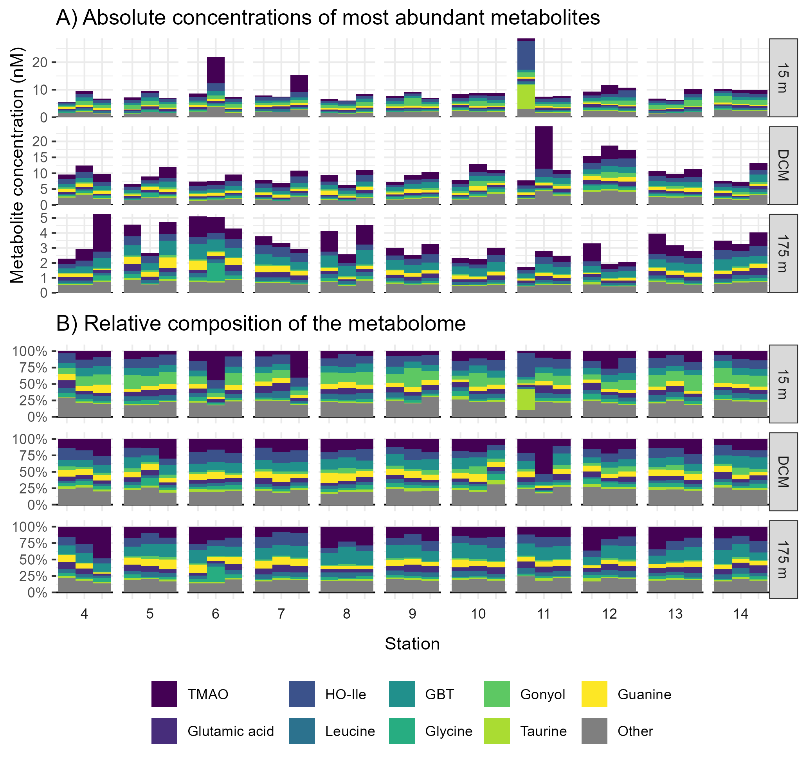

```{r Run analysis, include=FALSE}
if(!file.exists("../mzMLs/neg/180205_Poo_TruePoo_Full1.mzML")){
  init_timeout <- options("timeout")$timeout
  options(timeout=3600) # Allow 1 hour for each FTP download

  download.file("ftp://www.metabolomicsworkbench.org/Studies/ST002788_HILIC_NEG.zip",
                destfile = "../mzMLs/ST002788_HILIC_NEG.zip")
  unzip("../mzMLs/ST002788_HILIC_NEG.zip", exdir = "../mzMLs/neg")
  file.remove("../mzMLs/ST002788_HILIC_NEG.zip")
  download.file("ftp://www.metabolomicsworkbench.org/Studies/ST002789_HILIC_NEG.zip",
                destfile = "../mzMLs/ST002789_HILIC_NEG.zip")
  unzip("../mzMLs/ST002789_HILIC_NEG.zip", exdir = "../mzMLs/neg")
  file.remove("../mzMLs/ST002789_HILIC_NEG.zip")
  download.file("ftp://www.metabolomicsworkbench.org/Studies/ST002788_HILIC_POS.zip",
                destfile = "../mzMLs/ST002788_HILIC_POS.zip")
  unzip("../mzMLs/ST002788_HILIC_POS.zip", exdir = "../mzMLs/pos")
  file.remove("../mzMLs/ST002788_HILIC_POS.zip")
  download.file("ftp://www.metabolomicsworkbench.org/Studies/ST002789_HILIC_POS.zip",
                destfile = "../mzMLs/ST002789_HILIC_POS.zip")
  stop("File extraction has to be done manually - file too large for R's unzip")
  file.remove("../mzMLs/ST002789_HILIC_POS.zip")
  options(timeout=init_timeout)
}

if(!file.exists("../metadata/filled_file_metadata.csv")){
  setwd("../metadata")
  knitr::purl("metadata_control.Rmd")
  source("metadata_control.R")
  file.remove("metadata_control.R")
  setwd("../manuscript")
}

if(!file.exists("../targeted/all_peaks.csv")){
  setwd("../targeted")
  knitr::purl("../targeted/targeted_control.Rmd")
  source("targeted_control.R")
  file.remove("targeted_control.R")
  setwd("../manuscript")
}

if(!file.exists("../untargeted/all_peaks.csv")){
  setwd("../untargeted")
  knitr::purl("untargeted_control.Rmd")
  data_iters <- c("FK_pos", "FK_neg", "MS_pos", "MS_neg")
  for(cruise in c("FK", "MS")){
    for(polarity in c("pos", "neg")){
      source("untargeted_control.R")
    }
  }
  file.remove("../untargeted/untargeted_control.R")
  map(data_iters, function(output_dir){
    comb_peaks <- read_csv(paste0(output_dir, "_output/clean_peak_data.csv")) %>%
      mutate(temp=output_dir) %>%
      separate(temp, into = c("cruise", "polarity"), sep = "_") %>%
      mutate(feature=str_replace(feature, "FT", paste0(toupper(output_dir), "_")))
  }) %>%
    bind_rows() %>%
    write_csv("all_peaks.csv")
  map(data_iters, function(output_dir){
    comb_peaks <- read_csv(paste0(output_dir, "_output/clean_feat_data.csv")) %>%
      mutate(temp=output_dir) %>%
      separate(temp, into = c("cruise", "polarity"), sep = "_") %>%
      mutate(feature=str_replace(feature, "FT", paste0(toupper(output_dir), "_")))
  }) %>%
    bind_rows() %>%
    write_csv("all_feats.csv")
  setwd("../manuscript")
}
```

```{r setup, include=FALSE}
knitr::opts_chunk$set(echo = FALSE, message = FALSE, warning = FALSE, eval = FALSE)
library(tidyverse)
library(RaMS)

filled_file_metadata <- read_csv("../metadata/filled_file_metadata.csv") %>%
  filter(polarity=="pos") %>%
  select(-polarity)
clean_stans <- read_csv("../metadata/clean_stans.csv")
untarg_feats <- read_csv("../untargeted/all_feats.csv")
untarg_peaks <- read_csv("../untargeted/all_peaks.csv") %>%
  filter(str_detect(filename, "_Smp_"))
targ_peaks <- read_csv("../targeted/all_peaks.csv") %>%
    mutate(filename=paste0(filename, ".mzML"))

metadata_levels <- c(
    "no23_um", "po4_um", "si_um", "PC_um", "PN_um", "DON_um", "DOP_um", "oxy_um",
    "chl_ug", "phaeo_ug", "alk", "dic", "ph", "theta",
    paste0(c("pro", "syn", "euk", "het"), "_abund"), "beam_atten",
    "abs_depth", "time", "lat", "sla", "local_hour", 
    "TDN", "TDP", "temp", "pressure", "sal", "sigma",
    "ctd_chl"
  )
metadata_labels <- c(
    "Nitrate + nitrite", "Phosphate", "Silicate", "Particulate C", "Particulate N",
    "Dissolved organic N", "Dissolved organic P", "Oxygen", "Chlorophyll a",
    "Phaeophytin", "Alkalinity", "Dissolved inorganic C", "pH", "Density",
    paste(c("Pro.", "Syn.", "Picoeuk.", "Het. bact."), "abundance"),
    "Beam attenuation",
    "Depth", "Time", "Latitude", "Sea level anomaly", "Local hour", 
    "Total dissolved nitrogen", "Total dissolved phosphorus",
    "Temperature", "Pressure", "Salinity", "Sigma-theta",
    "Chlorophyll (fluor.)"
  )
metadata_twoline_labels <- c(
    "Nitrate + nitrite", "Phosphate", "Silicate", "Particulate C", "Particulate N",
    "Dissolved\norganic N", "Dissolved\norganic P", "Oxygen", "Chlorophyll a",
    "Phaeophytin", "Alkalinity", "Dissolved\ninorganic C", "pH", "Density",
    paste(c("Prochlorococcus", "Synechococcus", "Picoeukaryote", 
            "Heterotrophic bact."), "\nabundance"),
    "Beam attenuation",
    "Depth", "Time", "Latitude", "Sea level anomaly", "Local hour",
    "Total dissolved\nnitrogen", "Total dissolved\nphosphorus",
    "Temperature", "Pressure", "Salinity", "Sigma-theta", "Chlorophyll\n(fluorescence)"
  )
metadata_short_labels <- c("N+N", "PO4", "Si", "PC", "PN", "DON", "DOP", "O2", "Chl a",
                  "Phaeophytin", "Alk", "DIC", "pH", "Density", 
                  paste(c("Pro", "Syn", "Picoeuk", "Het. bact."), "abund"),
                  "Beam atten.", "Depth", "Time", "Latitude", "SLA", "Local hour",
                  "Tot. N", "Tot. P", "Temp", "dB", "Sal", "σ-θ", "CTD chl.")

splividis <- function(n, ...){
  vir <- viridis::viridis(n, ...)
  if(n%%2==0){
    vir[as.numeric(matrix(1:n, ncol=2, byrow = TRUE))]
  } else {
    index_vec <- suppressWarnings(as.numeric(matrix(1:n, ncol=2, byrow = TRUE)))
    vir[head(index_vec, -1)]
  }
}
```

# Abstract

TBD

# Introduction

High frequency, long-term observations at Station ALOHA in the North Pacific Subtropical Gyre (NPSG) over the past 25 years have revealed temporal and spatial variability in what had prevously been considered a homogenous environment [@Karl1999; @Karl2017; @Karl2021]. A major source of variability comes in the form of mesoscale eddies in which water is entrained into circular surface currents tens to hundreds of kilometers in diameter [@Karl2017; @McGillicuddy2016]. These mesoscale features introduce nutrients into the euphotic zone and alter the community composition [@Sweeney2003; @Barone2019]. In particular, the depth and intensity of the deep chlorophyll maximum (DCM) at the top of the nitricline differs dramatically between cyclonic and anticyclonic eddies. @Barone2022 reported a shift in the microbial community at the DCM with eukaryotic phytoplankton enriched and prokaryotic phytoplankton depleted in cyclonic eddies, and @Hawco2021 and @Dugenne2023 showed that some of this difference was due to alterations in dissolved iron chemistry and nitrogen fixation.

Here, we use measurements of metabolites in particles across an eddy dipole in the North Pacific Subtropical Gyre (NPSG) to categorize both known compounds and unidentified mass features based on their co-occurrence with a set of simultaneously measured physical, chemical, and biological parameters. The gyre in particular represents an intriguing opportunity for metabolomic research because it has been shown to contain the highest proportion of chemical features with unknown structure and function, many of which have highly variable responses to changes in latitude, depth, and across diel cycles [@Heal2021; @Boysen2021; @Kumler2023]. This study connects biogeochemical measurements to a molecular-scale perspective of particulate organic matter, linking the chemical currencies that fuel metabolism and interactions among marine microbes to the mesoscale environment in which the currencies are found.

# Results
## Metabolome variability across the eddy dipole

Using data for all molecular features, we found that the metabolome differed between the cyclone and anticyclone samples, with multivariate statistics detecting the largest differences in the DCM and 175 meter samples (Figure 1). At the DCM, approximately 16% of the variation in the metabolome could be explained by SLA alone according to the PERMANOVA (p = 0.003) and SLA was strongly correlated with the first principal component (r = .615, % variance explained by PC1 = 27.2), indicating that this was one of the largest sources of variation in the dataset. Notably, the samples taken from the exact center of the cyclonic eddy were highly distinct and likely drove much of the variance explained. In the 175m samples, 12% of the variance was explained by SLA (p = 0.008) according to the PERMANOVA and SLA was highly correlated with the second PC of the dataset (r = .697, % variance explained by PC2 = 15.4), though the first PC did not seem to have any visible pattern with metadata and appeared to capture largely variation between biological triplicates (Supplemental figure 1). At the surface, SLA trends are less evident with a larger p-value (0.087) and a lower R$^2$ (0.09) (Figure 1).

To characterize this difference, we plotted an "average" metabolite peak area per station at each depth by taking the median value of all the detected mass features after z-score normalization (Figure 1). As expected, the average metabolite collected at the exact center of the cyclonic eddy (Station 12) was much more abundant than in any sample at this same depth in the rest of the dipole samples. Similarly, the 175 meter samples showed the largest metabolite abundances in the anticyclone relative to other stations at this depth. This method also allowed us to see the remarkably sinusoidal response of the average metabolite across the stations. This response correlated negatively with SLA at the DCM (lower SLA = higher average values, $r_{DCM}= -.716$) but positively with SLA at the surface and at depth ($r_{surface} = .211$, $r_{deep} = .830$).

```{r multivar_analysis object creation - nmds/pca/permanova}
set.seed(123)
multivar_analysis <- untarg_peaks %>%
  left_join(filled_file_metadata %>% distinct(ms_run, station, filename, depth), 
          by="filename") %>%
  mutate(depth=factor(depth, levels=c("Surface", "DCM", "Deep"), 
                      labels=c("Surface  (15m)", "DCM  (110-120m)", "Deep  (175m)"))) %>%
  filter(ms_run=="MT") %>%
  nest(data=-depth) %>%
  mutate(wide_peaks=map(data, function(metab_df){
    metab_df %>%
      select(feature, filename, norm_area) %>%
      group_by(feature) %>%
      filter(sum(norm_area==0)<n()*0.9) %>%
      mutate(norm_area=scale(norm_area)[,1]) %>%
      pivot_wider(names_from = "feature", values_from = norm_area) %>%
      column_to_rownames("filename") %>%
      data.matrix()
  })) %>%
  mutate(nmds_output=map(wide_peaks, function(metab_mat){
    env_vec <- pull(filled_file_metadata, sla_corr, filename)[rownames(metab_mat)]
    vegan::metaMDS(metab_mat, k = 2, distance = "manhattan", trace = 0, 
                   autotransform = FALSE, noshare = FALSE, wascores = FALSE) %>%
    vegan::MDSrotate(env_vec)
  })) %>%
  mutate(nmds_stress=map_dbl(nmds_output, pluck, "stress")) %>%
  mutate(perm_output=map(wide_peaks, function(metab_mat){
    adon_expl <- data.frame(filename=rownames(metab_mat)) %>%
      left_join(filled_file_metadata %>% select(filename, sla_class), by="filename")
    vegan::adonis2(
      metab_mat~sla_class, data = adon_expl, by = "margin", 
      permutations = 999, method = "manhattan")
  })) %>%
  mutate(perm_r2=map_dbl(perm_output, pluck, "R2", 1)) %>%
  mutate(perm_pval=map_dbl(perm_output, pluck, "Pr(>F)", 1)) %>%
  mutate(pca_output=map(wide_peaks, prcomp)) %>%
  mutate(nmds_stress=paste("s =", round(nmds_stress, digits = 3))) %>%
  mutate(perm_r2=round(perm_r2, digits = 2)) %>%
  mutate(perm_pval=round(perm_pval, digits = 4)) %>%
  mutate(perm_label=paste0("R2 = ", perm_r2, "\np = ", perm_pval))
```

```{r figure nmds and median metabolite across eddy transect}
nmds_sla_gp <- multivar_analysis %>%
  mutate(nmds_points=map(nmds_output, function(nmds_output_i){
    nmds_output_i %>% pluck("points") %>% as.data.frame()
  })) %>%
  select(depth, nmds_points) %>%
  unnest_longer(nmds_points, indices_to = "filename") %>%
  unnest_wider(nmds_points) %>%
  left_join(filled_file_metadata %>% distinct(filename, sla_corr)) %>%
  mutate(MDS2=ifelse(str_detect(depth,"Deep"), MDS2*-1, MDS2)) %>%
  ggplot() +
  geom_vline(xintercept = 0) +
  geom_hline(yintercept = 0) +
  geom_point(aes(x=MDS1, y=MDS2, fill=sla_corr), color="black", size=4, pch=21) +
  geom_label(x=-Inf, y=-Inf, aes(label=nmds_stress), hjust=0, vjust=0, 
             data = multivar_analysis, label.r = unit(0, "in")) +
  geom_label(x=-Inf, y=Inf, aes(label=perm_label), hjust=0, vjust=1,
             data = multivar_analysis, label.r = unit(0, "in"), lineheight = .7) +
  facet_wrap(~depth, nrow=1) +
  scale_fill_gradient2(
    low = scales::muted("blue"), high = scales::muted("red"),  mid = "grey90",
    aesthetics = c("color", "fill"),
  ) +
  labs(fill="Sea level\nanomaly\n(cm)\n") +
  theme_bw() +
  coord_fixed()

med_metab_df <- untarg_peaks %>%
  left_join(filled_file_metadata %>% distinct(filename, ms_run, station, depth, sla_corr),
            by="filename") %>%
  filter(ms_run=="MT") %>%
  group_by(depth, feature) %>%
  filter(sum(norm_area==0)<n()*0.9) %>%
  mutate(norm_area=scale(norm_area)[,1]) %>%
  ungroup() %>%
  group_by(filename, depth, station, sla_corr) %>%
  summarize(avg_amt=mean(norm_area)) %>%
  ungroup()
# Calculations for correlation between grand median metabolite and SLA
# med_metab_df %>%
#   group_by(station, depth, sla_corr) %>%
#   summarise(grand_avg_amt=mean(avg_amt)) %>%
#   group_by(depth) %>%
#   summarise(sim=cor(sla_corr, grand_avg_amt))
med_metab_sla_gp <- med_metab_df %>%
  mutate(station=factor(station, levels=as.character(4:14))) %>%
  mutate(depth=factor(depth, levels=c("Surface", "DCM", "Deep"))) %>%
  ggplot() +
  geom_hline(yintercept = 0) +
  geom_boxplot(aes(x=station, y=avg_amt, color=sla_corr), linewidth=0.8) +
  facet_wrap(~depth, nrow=1) +
  scale_color_gradient2(low = scales::muted("blue"), high = scales::muted("red"),
                        mid="grey90", aesthetics = c("color", "fill"), guide = NULL) +
  theme_bw() +
  theme(strip.background = element_blank(), strip.text = element_blank()) +
  labs(x="Station", y="Median metabolite z-score")

library(egg)
nolegend_plot <- ggarrange(nmds_sla_gp+theme(legend.position = "none"), 
                           med_metab_sla_gp, ncol = 1, heights = c(0.7, 0.3), 
                           draw = FALSE)
library(cowplot)
nmds_and_med_metab <- plot_grid(nolegend_plot, get_legend(nmds_sla_gp), 
                                nrow=1, rel_widths = c(0.9, 0.1))
ggsave("nmds_and_med_metab.png", plot = nmds_and_med_metab, device = "png", 
       path = "figures", width = 6.875, height = 4.5, units = "in", dpi = 300,
       bg="white")
```


*Figure 1: Plots of the metabolome across the eddy dipole, broken down by depth. The top row of plots are non-metric multidimensional scaling (NMDS) plots, in which points correspond to individual samples and have been colored by their corrected sea level height anomaly. NMDS stress values (s) have been reported in the bottom left corner, while PERMANOVA R$^2$ and p-values are reported in the top left. SLA trends are visible in the DCM and deep samples, with dark blue circles consistently discriminating from the dark red circles along the first multidimensional axis. The bottom row of plots show the direction and magnitude of this effect by plotting the grand median of the z-score normalized metabolite peak areas in the stations taken across the eddy dipole with the upper whisker extent, median bar, and lower whisker extent corresponding to the values measured in three biological triplicates.*

We expected a large part of the difference in metabolomes with respect to SLA to be due to the increased biomass in the cyclone DCM and the parallel increase in the anticyclone deep samples. Within our molecular feature population, a subset are known metabolites that we quantified using standards (Figure 2).

```{r figure stacked barplot MT eddy transect w PC and SLA}
avg_targ_concs <- targ_peaks %>%
  left_join(filled_file_metadata, by="filename") %>%
  filter(ms_run=="MT") %>%
  filter(samp_type=="Smp") %>%
  group_by(compound_name) %>%
  mutate(mean_cmpd_nm=mean(nM)) %>%
  ungroup()
arrow_df <- data.frame(
  cyc_type=c("Anticyclone\ncenter", "Cyclone\ncenter"),
  x=c("6", "12"), xend=c("6", "12"),
  y=c(5, 4), yend=c(9.5, 6.5),
  color=c(scales::muted("red"), scales::muted("blue")),
  depth=factor("Deep", levels=c("Surface", "DCM", "Deep"), 
               labels=c("Surface  (15m)", "DCM  (110-120m)", "Deep  (175m)")),
  lab_x=c("5", "10")
)
barplot_targ_gp <- avg_targ_concs %>%
  group_by(compound_name, untripl) %>%
  summarise(nM=median(nM), mean_cmpd_nm=unique(mean_cmpd_nm)) %>%
  ungroup() %>%
  arrange(desc(mean_cmpd_nm)) %>%
  mutate(compound_name=ifelse(compound_name=="Trimethylamine N-oxide", "TMAO", compound_name)) %>%
  mutate(compound_name=ifelse(compound_name=="Hydroxyisoleucine", "HO-Ile", compound_name)) %>%
  mutate(compound_name=ifelse(compound_name=="Glycine betaine", "GBT", compound_name)) %>%
  mutate(compound_name=str_remove(compound_name, "^L-")) %>%
  mutate(compound_name=ifelse(
    compound_name%in%head(unique(compound_name), 9), 
    compound_name, "Other")) %>%
  mutate(compound_name=fct_inorder(compound_name)) %>%
  left_join(filled_file_metadata %>% distinct(untripl, depth, station)) %>%
  group_by(depth, station, compound_name) %>%
  summarise(nM=sum(nM), .groups = "keep") %>%
  summarise(mean_nM=mean(nM)) %>%
  mutate(depth=factor(depth, levels=c("Surface", "DCM", "Deep"), 
                      labels=c("Surface  (15m)", "DCM  (110-120m)", "Deep  (175m)"))) %>%
  mutate(station=factor(station, levels=as.character(4:14))) %>%
  ggplot() +
  geom_hline(yintercept = 0) +
  geom_col(aes(x=station, y=mean_nM, fill=compound_name), width = 0.9) +
  scale_fill_manual(values = c(splividis(9), "grey50")) +
  scale_y_continuous(expand = c(0.005, 0.1)) +
  labs(x=NULL, y="Median nM\nmetabolite concentration", fill=NULL) +
  facet_grid(~depth, scales="free", space = "free") +
  guides(fill=guide_legend(nrow=2, byrow = TRUE)) +
  ggnewscale::new_scale_fill() +
  geom_segment(aes(x=x, y=y, xend=xend, yend=yend, color=color), data=arrow_df,
               arrow=arrow(ends = "first", length = unit(0.1, "npc"), type = "closed"),
               linewidth=0, linejoin = "bevel") +
  geom_segment(aes(x=x, y=y+0.5, xend=xend, yend=yend, color=color), 
               data=arrow_df, linewidth=2) +
  geom_text(aes(x=lab_x, y=yend+0.5, color=color, label=cyc_type), 
            data=arrow_df, vjust=0, hjust=0, lineheight=0.8) +
  scale_x_discrete(breaks=as.character(seq(4, 14, 2))) +
  scale_fill_gradient2(
    low = scales::muted("blue"), high = scales::muted("red"),  mid = "grey90",
    aesthetics = c("fill"), guide = "none"
  ) +
  scale_color_identity() +
  theme_bw() +
  theme(legend.position = "top", axis.text.x = element_blank(), 
        legend.margin = margin(t = 10,0,0,0), 
        legend.box.margin = margin(-10,-10,-10,-10),
        plot.margin = unit(numeric(4), "cm"),
        strip.text = element_text(face = "bold"),
        plot.background = element_rect(fill="white"))


frac_pc_in_metab_df <- targ_peaks %>%
  filter(str_detect(filename, "180821_Smp")) %>%
  left_join(clean_stans %>% select(compound_name, formula, polarity)) %>%
  mutate(n_C=as.numeric(str_extract(formula, "(?<=C)\\d+"))) %>%
  mutate(nM_C=n_C*nM) %>%
  left_join(filled_file_metadata, by = join_by(filename)) %>%
  filter(samp_type=="Smp") %>%
  group_by(filename) %>%
  summarize(total_nM=sum(nM_C), PC_um=unique(PC_um)) %>%
  mutate(frac_in_metab=total_nM/1000/PC_um) %>%
  left_join(filled_file_metadata, by = join_by(filename, PC_um)) %>%
  mutate(depth=str_extract(depth, "DCM|Deep|Surface")) %>%
  mutate(depth=factor(depth, levels=c("Surface", "DCM", "Deep"))) %>%
  mutate(station=factor(station, levels=c(as.character(4:14))))
pc_frac_metab_gp <- frac_pc_in_metab_df %>%
  ggplot(aes(x=station, y=frac_in_metab, color=sla_corr)) +
  geom_hline(yintercept = 0) +
  geom_boxplot(width = 0.9, linewidth=0.8) +
  scale_x_discrete(breaks=as.character(seq(4, 14, 2))) +
  scale_y_continuous(labels = scales::label_percent()) +
  facet_grid(~depth, scales="free") +
  scale_color_gradient2(
    low = scales::muted("blue"), high = scales::muted("red"),  mid = "grey90",
    aesthetics = c("color", "fill")
  ) +
  guides(color=guide_colorbar(direction = "horizontal", title.position = "top", 
                              title.hjust = 0.5, barheight = 0.2, reverse = TRUE)) +
  labs(color="Corr. SLA (cm)", x="Station",
       y="Fraction of PC represented\nby known metabolites") +
  theme_bw() +
  theme(legend.position = c(0.84, 0.75), legend.background = element_rect(color="grey90"),
        strip.background = element_blank(), strip.text = element_blank(),
        plot.margin = margin(0,1,0,0), plot.background = element_rect(fill="white"))

targ_gp_w_sla_frac <- egg::ggarrange(barplot_targ_gp, pc_frac_metab_gp, draw = FALSE)

plot(targ_gp_w_sla_frac)

ggsave("targ_gp_w_sla_frac.png", plot = targ_gp_w_sla_frac, device = "png", 
       path = "figures", width = 6.875, height = 4.5, units = "in", dpi = 300, 
       bg = "white")
```


*Figure 2: Upper row of stacked barplots shows known compounds measured across the eddy dipole and separated by depth. Bar height corresponds to median triplicate concentration for each metabolite, with the top 9 shown and the 44 other identified metabolites summed in grey. TMAO = trimethylamine N-oxide, HO-Ile = hydroxyisoleucine, GBT = glycine betaine, DCM = deep chlorophyll maximum. Lower row of boxplots shows the fraction of total particulate carbon (PC) in the known metabolites across the eddy dipole, with the upper whisker extent, median bar, and lower whisker extent corresponding to the values measured in three biological triplicates. Colors correspond to corrected sea level anomaly (Corr. SLA) in centimeters, with dark red indicating anticyclonic (positive SLA) and dark blue indicating cyclonic (negative SLA) eddy state.*

```{r avg targ conc values and numbers for text, eval=FALSE}
avg_targ_concs %>%
  mutate(compound_name=fct_inorder(compound_name)) %>%
  mutate(depth=factor(depth, levels=c("Surface", "DCM", "Deep"))) %>%
  group_by(depth, compound_name) %>%
  summarise(nM=mean(nM)) %>%
  arrange(compound_name) %>%
  pivot_wider(names_from = depth, values_from = nM) %>%
  write_csv("supplement/avg_targ_conc_by_depth.csv")
avg_targ_concs %>%
  mutate(depth=factor(depth, levels=rev(c("Surface", "DCM", "Deep")))) %>%
  group_by(compound_name, depth) %>%
  summarise(nM=mean(nM)) %>%
  mutate(nM=log10(nM)) %>%
  ggplot(aes(x=nM, y=depth, group=compound_name)) +
  geom_path()
avg_targ_concs %>%
  mutate(depth=factor(depth, levels=rev(c("Surface", "DCM", "Deep")))) %>%
  group_by(compound_name, depth) %>%
  summarise(nM=mean(nM)) %>%
  mutate(nM=rank(nM)) %>%
  ungroup() %>%
  pivot_wider(names_from = depth, values_from = nM) %>%
  mutate(depth_class=paste(Surface, DCM, Deep)) %>%
  count(depth_class)
```

We found that the overall concentration of known molecules was highest at the DCM of the cyclone, in line with our expectations and prior results. The most abundant quantified molecule overall was trimethylamine N-oxide (TMAO), with an average concentration of 1.38 nM and a distinct DCM maximum (Figure 2). This pattern of a subsurface maximum at the DCM was mirrored by a majority of the known molecules (37/53). Most other abundant molecules decreased monotonically with depth, with highest values at the surface (Figure 2).

```{r PC_vs_totnM regression values, eval=FALSE}
no_outlier_frac_pc_in_metab_df <- frac_pc_in_metab_df %>%
  filter(!(station=="11" & tripl=="A" & depth=="Surface")) %>%
  filter(!(station=="6" & tripl=="B" & depth=="Surface")) %>%
  filter(!(station=="7" & tripl=="C" & depth=="Surface")) %>%
  filter(!(station=="11" & tripl=="B" & depth=="DCM"))

# Overall trend between PC and total nM metabolites (all depths)
broom::tidy(lm(total_nM~PC_um, data=no_outlier_frac_pc_in_metab_df))[2,]
with(no_outlier_frac_pc_in_metab_df, cor(PC_um, total_nM))
lme4::lmer(total_nM~PC_um + (1|depth), data=no_outlier_frac_pc_in_metab_df)

# By-depth trend between PC and total nM metabolites
no_outlier_frac_pc_in_metab_df %>%
  group_by(depth) %>%
  summarise(overall=broom::tidy(lm(total_nM~PC_um))[2,], 
            cor_vals=cor(PC_um, total_nM))
```

The small-scale oceanographic variability introduced by mesoscale eddy features allowed us to also test the robustness of a model expecting a linear relationship between the total carbon contained within metabolites and bulk particulate carbon (PC) measurements. As expected, PC values showed a strong trend with summed metabolite concentrations ($\beta = 23.7\pm1.35$ (SE), Pearson's $r$ = .876, p-value < 0.001, Figure 2.5). This overall trend was largely driven by higher values in the surface than at depth, but when analyzed at each depth individually the general correspondence held. The DCM had the strongest trend ($\beta = 22.1\pm2.24$, $r= .689$, p-value < 0.001) while Surface ($\beta = 16.0\pm7.45$, $r = .375$, p-value = 0.04) and Deep ($\beta = 23.9\pm7.36$, $r = 0.503$, p-value = 0.003) values were weaker but still compelling relationships (Figure 2.5). However, this association required the removal of three samples in the surface and one in the DCM with anomalously high metabolite loads as well as two surface PC samples with anomalously high values from Stations 10 and 11 for which PC was interpolated by linear regression against beam attenuation. The full regression is reported in Supplemental Figure 3.

```{r Fig 2.5 PC vs tot nM plot}
pc_totalnm_plot <- no_outlier_frac_pc_in_metab_df %>%
  ggplot(aes(x=PC_um, y=total_nM)) +
  geom_point(aes(fill=depth), pch=21, size=3) +
  geom_smooth(method="lm", color="white", lwd=2.5, se=FALSE) +
  geom_smooth(method="lm", color="black", lwd=1.5) +
  geom_smooth(aes(group=depth), method="lm", color="white", lwd=2.5, se = FALSE) +
  geom_smooth(aes(color=depth), method="lm", lwd=1.5) +
  theme_bw() +
  theme(legend.position = "top") +
  labs(color="Sampling depth",
       fill="Sampling depth",
       x="Particulate carbon (uM)", 
       y="Total nM carbon in known metabolites") +
  scale_color_manual(breaks=c("Surface", "DCM", "Deep"), 
                     values = c("#F4BB23", "#028E34", "#0B505C"), aesthetics = c("fill", "color"))
pc_totalnm_plot_bydepth <- no_outlier_frac_pc_in_metab_df %>%
  ggplot() +
  aes(x=PC_um, y=total_nM) +
  geom_smooth(method="lm", color="black") +
  geom_point(aes(fill=sla_corr), pch=21, color="black") +
  facet_wrap(~depth, ncol=1, scales="free") +
  labs(x="Particulate\ncarbon (uM)", y="Total nM carbon in known metabolites") +
  scale_fill_gradient2(
    low = scales::muted("blue"), high = scales::muted("red"),  mid = "grey90",
    aesthetics = c("fill"), name="Corr.\nSLA\n(cm)"
  ) +
  theme_bw() +
  theme(strip.text = element_text(face = "bold"))

comb_pcnm_plot <- cowplot::plot_grid(pc_totalnm_plot, pc_totalnm_plot_bydepth, 
                                     rel_widths = c(5, 3))

ggsave("comb_pcnm_plot.png", plot = comb_pcnm_plot, device = "png", 
       path = "figures", width = 6.875, height = 4.5, units = "in", dpi = 300, 
       bg = "white")
```


*Figure 2.5: Type I linear regressions of particulate carbon against total nM carbon in known metabolites both as a whole and divided by depth. Points have been colored according to the SLA and have been placed on independent axes. Outlier metabolite points have been removed from the surface at stations 6, 10, and 11 as well as a DCM sample from station 12, while two outlier PC points have been interpolated from beam attenuation for surface values at stations 10 and 11. For the full regression, see Supplemental Figure 3.*

```{r PC vs total_nM ANOVA by depth, eval=FALSE}
# More carbon in metabolites at DCM when outliers removed?
no_outlier_frac_pc_in_metab_df %>%
  mutate(pred_total_nM=predict(lm(formula=total_nM~PC_um, data=.), newdata=.)) %>%
  select(filename, depth, station, sla_class, sla_corr, total_nM, PC_um, pred_total_nM) %>%
  mutate(total_nM_resid=total_nM-pred_total_nM) %>%
  aov(formula=total_nM_resid~depth) %>% TukeyHSD() %>% broom::tidy()
  # ggplot() + geom_boxplot(aes(x=depth, y=total_nM_resid)) + aes(color=sla_class)

# More carbon in metabolites at DCM when outliers handled with rank testing?
frac_pc_in_metab_df %>%
  mutate(pred_total_nM=predict(lm(formula=total_nM~PC_um, data=.), newdata=.)) %>%
  select(filename, depth, total_nM, PC_um, pred_total_nM) %>%
  mutate(total_nM_resid=rank(total_nM-pred_total_nM)) %>%
  kruskal.test(formula=total_nM_resid~depth) %>% broom::tidy()
  # ggplot() + geom_boxplot(aes(x=depth, y=total_nM_resid))

# More carbon in metabolites at DCM when measured by % in metabs too
no_outlier_frac_pc_in_metab_df %>%
  aov(formula=frac_in_metab~depth) %>% TukeyHSD() %>% broom::tidy()
  # ggplot() + geom_boxplot(aes(x=depth, y=frac_in_metab))
no_outlier_frac_pc_in_metab_df %>%
  group_by(depth) %>%
  summarise(median(frac_in_metab))
frac_pc_in_metab_df %>%
  kruskal.test(formula=frac_in_metab~depth, data=.) %>% broom::tidy()
  # ggplot() + geom_boxplot(aes(x=depth, y=rank(frac_in_metab)))
```

Known metabolites contributed between 1.5% and 5% of the carbon to the total PC load with higher values at the DCM than the surface or 175m samples (Figure 2, Supplemental Figure 3). DCM samples contained approximately 25% (0.5 percentage points) more carbon in the known metabolite pool (One-way ANOVA with outliers removed plus Tukey post-hoc, p<0.001, n=30-33) but there was no clear trend with SLA.

```{r comparison to Angies PC values way higher than mine, eval=FALSE}
angie_pcdata <- "../metadata/raw_data/Karl_HL2_WC_PCPN_Final_Data.xlsx" %>%
  openxlsx::read.xlsx() %>%
  slice(-1) %>%
  select(abs_depth=`Depth.(m)`, PC_um=`C.value.(µmol/L)`) %>%
  # filter(depth<30) %>%
  mutate(cruise="HOE-Legacy")

my_pcdata <- filled_file_metadata %>%
  # filter(depth=="Surface") %>%
  distinct(abs_depth, PC_um) %>%
  mutate(cruise="MESOSCOPE")

rbind(angie_pcdata, my_pcdata) %>%
  ggplot() +
  geom_point(aes(x=PC_um, y=-abs_depth, color=cruise))
```

### A single sample highlights a network of related metabolites

One sample, taken from the surface at Station 11 (MS11C215m_A), was highly distinct from all others (including its paired triplicates) with several metabolites measuring two or more orders of magnitude larger in peak area and concentration both before and after normalization to internal standards. Heuristic exploration of potentially related masses identified a total of 14 compounds highly abundant in this one sample alone. The only identified compounds with this trend were taurine and acetyltaurine, though three others with *m/z* 146.1176, 148.0968, and 206.1388 were discovered to be likely isomers of known compounds (acetylcholine/(3-carboxypropyl)trimethylammonium, hydroxyisoleucine, and dexpanthenol, respectively). One feature (*m/z* = 184.0637, RT = 7.0 minutes) was identified as choline sulfate using a second run of standards, while an additional mass feature at 168.0689 and RT = 8.5 was putatively flagged as taurine betaine. This mass was also one of the most highly enriched in the MS11C215m_A sample after taurine itself, with a peak area nearly 30x that of the next largest sample. No clear explanation emerged explaining why some compounds were hyperabundant in this surface sample, though one possible explanation was the *Trichodesmium* bloom occurring at the same time [@Dugenne2023].

```{r MS11A offenders table}
ms11_offenders <- untarg_peaks %>%
  filter(str_detect(filename, "180821")) %>%
  group_by(feature) %>%
  filter(sum(norm_area==0)<3) %>%
  mutate(cursed_area=norm_area[filename=="180821_Smp_MS11C215m_A.mzML"]) %>%
  filter(cursed_area>0) %>%
  mutate(rel_area=norm_area/cursed_area) %>%
  filter(filename!="180821_Smp_MS11C215m_A.mzML") %>%
  group_by(feature) %>%
  summarise(mean_rel=mean(rel_area), max_rel=max(rel_area)) %>%
  # ggplot(aes(x=mean_rel, y=max_rel, label=feature)) + geom_point() + 
  # scale_y_log10() + scale_x_log10() +
  # geom_vline(xintercept = 0.25) + geom_hline(yintercept = 0.5)
  filter(mean_rel<0.25 & max_rel < 0.5) %>%
  arrange(mean_rel) %>% 
  add_row(feature="MS_NEG_1123") %>%
  left_join(untarg_feats %>% select(feature:compound_name)) %>%
  mutate(mzmed=ifelse(str_detect(feature, "NEG"), mzmed+1.007276*2, mzmed)) %>%
  filter(feature!="MS_NEG_0768") %>% # Remove taurine duplicate
  add_row(mzmed=c(198.0794, 184.0637), rtmed=c(5, 7))

# ms11_offenders$mzmed %>% sort() %>% `names<-`(., round(., digits=3)) %>% dist(diag = TRUE) %>% round(digits=4)

stans <- read_csv("https://raw.githubusercontent.com/IngallsLabUW/Ingalls_Standards/master/Ingalls_Lab_Standards.csv") %>%
  filter(Column=="HILIC" & z>0) %>%
  select(cmpd_name=Compound_Name, formula=Empirical_Formula) %>%
  group_by(formula) %>%
  summarise(cmpd_name=paste(cmpd_name, collapse = ", "))
base_mz <- 85.089149355+1.007276
iter_mzs <- expand_grid(CH2=0:6, O=2:6) %>%
  mutate(mz=base_mz+CH2*14.01565+O*15.994915) %>%
  mutate(mz=round(mz, digits=5)) %>%
  mutate(cmd=paste0("mz%between%pmppm(", mz, ", 10)")) %>%
  mutate(formula=paste0("C", 5+CH2, "H", 11+CH2*2, "NO", O)) %>%
  left_join(stans) %>%
  mutate(label=ifelse(is.na(cmpd_name), formula, paste0(formula, " (", cmpd_name, ")"))) %>%
  mutate(casewhen_arg=paste0(cmd, "~'", label, "'"))
ms11_df <- c("C11H23NO6", "C11H23NO6", "C9H19NO5", "C8H17NO5", "C6H13NO6", "C8H17NO4") %>%
  data.frame(formula=., rtmed=c(8.5, 10, 8.5, 10.2, 5.2, 9.2)) %>%
  left_join(iter_mzs) %>%
  select(mzmed=mz, rtmed, formula, cmpd_name) %>%
  bind_rows(ms11_offenders) %>%
  arrange(mzmed) %>%
  select(mzmed, rtmed, formula, compound_name, feature) %>%
  mutate(formula=case_when(
    compound_name=="Taurine"~"C2H8NO3S",
    feature=="MS_POS_1050"~"C7H16NO2",
    compound_name=="Hydroxyisoleucine"~"C6H14NO3",
    compound_name=="N-Acetyltaurine"~"C4H10NO4S",
    feature=="MS_POS_1340"~"C5H14NO3S",
    feature=="MS_POS_1419"~"C8H18NO3",
    mzmed%between%pmppm(184.0637, 10)~"C5H14NO4S",
    mzmed%between%pmppm(198.0794, 10)~"C6H16NO4S",
    compound_name=="Dexpanthenol"~"C9H20NO4",
    TRUE~formula
  )) %>%
  mutate(compound_name=case_when(
    compound_name=="(3-Carboxypropyl)trimethylammonium?"~NA,
    compound_name=="Hydroxyisoleucine"~NA,
    compound_name=="Dexpanthenol"~NA,
    formula=="C5H14NO4S"~"Choline sulfate",
    formula=="C5H14NO3S"~"Taurine betaine?",
    TRUE~compound_name
  )) %>%
  mutate(rtmed=round(rtmed, 1)) %>%
  mutate(compound_name=ifelse(is.na(compound_name), "", compound_name)) %>%
  mutate(feature=ifelse(is.na(feature), "", feature)) %>%
  dplyr::rename(`Median m/z`=mzmed, `Median RT`=rtmed, `Putative formula`=formula,
                `Compound name`=compound_name, `Feature ID`=feature)
knitr::kable(ms11_df)
```

| Median m/z| Median RT|Putative formula |Compound name    |Feature ID  |
|----------:|---------:|:----------------|:----------------|:-----------|
|   126.0221|      11.1|C2H8NO3S         |Taurine          |MS_POS_0677 |
|   146.1176|       8.5|C7H16NO2         |                 |MS_POS_1050 |
|   148.0968|       8.5|C6H14NO3         |                 |MS_POS_1080 |
|   168.0317|       4.9|C4H10NO4S        |N-Acetyltaurine  |MS_NEG_1123 |
|   168.0689|       8.5|C5H14NO3S        |Taurine betaine? |MS_POS_1340 |
|   176.1282|       8.1|C8H18NO3         |                 |MS_POS_1419 |
|   184.0637|       7.0|C5H14NO4S        |Choline sulfate  |            |
|   192.1230|       9.2|C8H17NO4         |                 |            |
|   196.0816|       5.2|C6H13NO6         |                 |            |
|   198.0794|       5.0|C6H16NO4S        |                 |            |
|   206.1388|       7.1|C9H20NO4         |                 |MS_POS_1683 |
|   208.1180|      10.2|C8H17NO5         |                 |            |
|   222.1336|       8.5|C9H19NO5         |                 |            |
|   266.1598|       8.5|C11H23NO6        |                 |            |
|   266.1598|      10.0|C11H23NO6        |                 |            |

*Table 1: Detected mass features with peak areas in sample MS11C215m_A much larger than the sample with the next-largest peak area. RT = retention time in minutes. Taurine betaine is followed by a ? to denote that this identification is putative. Feature ID is a disambiguating key produced by XCMS processing.*

```{r trichobloomsamples comparison, eval=FALSE}
library(RaMS)
trichodata <- list.files("../mzMLs/tricho_pos", pattern=".mzML", full.names = TRUE) %>%
  grabMSdata()
tricho_eics <- ms11_df %>%
  pmap(function(...){
  row_data <- list(...)
  peak_data <- trichodata$MS1[mz%between%pmppm(row_data$mzmed, 10)]
  cbind(peak_data, formula=row_data$formula)
}) %>%
  bind_rows()

tricho_eics %>%
  filter(rt%between%c(2, 15)) %>%
  arrange(mz) %>%
  mutate(formula=fct_inorder(formula)) %>%
  ggplot() +
  geom_line(aes(x=rt, y=int, group=filename)) +
  facet_wrap(~formula, scales="free", ncol=2) +
  geom_vline(aes(xintercept = rtmed), color="red", data=ms11_df)

trichodata$MS1[mz%between%pmppm(162.1125, 10)] %>%
  mutate(samp_type=str_extract(filename, "Smp|Poo|Mix1|Mix2|Mat")) %>%
  filter(samp_type!="Mat") %>%
  ggplot() +
  geom_line(aes(x=rt, y=int, group=filename, color=samp_type)) +
  ggtitle("Homoserine betaine in Tricho bloom samples")
```

We explored this *Trichodesmium* hypothesis further by analyzing additional samples taken from the bloom to see whether compounds abundant in hand-picked *Trichodesmium* colonies were also abundant in samples taken directly from the bloom itself. After searching for the 14 mass features above in the environmental sample, 7 had good-quality peaks when viewed in the bloom samples as extracted ion chromatograms, though only 4 of these matched closely in retention time. We also performed a search of the untargeted data for homoserine betaine, a known *T. erythraeum* (strain IMS101) osmolyte [@Pade2016]. Although this compound was not in our standard library due to a lack of authentic standards, we identified three mass features in the 162.1125 *m/z* window with retention times of 7.1, 8.4, and 9.9 minutes. The feature at RT 9.9 matched our carnitine standard's retention time, leaving the two earlier peaks with putative identifications of threonine betaine at 7.1 and homoserine betaine at 8.4 given the elution order of threonine before homoserine in our authentic standards. This order is the reverse of that in @Pade2016, which showed homoserine betaine eluting prior to carnitine as expected given our use of a polar HILIC column and their use of a nonpolar Hypercarb column. They did not report an additional peak detected at this mass, leaving our putative identification of the threonine betaine as low-confidence. None of the three 162.1125 features showed the same degree of enrichment in MS11C215m_A as taurine or the other 13 compounds detected, though MS11C215m_A was the largest, second-largest, and third-largest peak for carnitine, threonine betaine, and homoserine betaine, respectively.

```{r homoserinebetaine search, eval=FALSE}
library(arrow)
dset <- open_dataset("../tmzMLs/MT_all_file_arr_pqds/")
hmb_eic <- dset %>%
  filter(mz%between%pmppm(162.1125, 10)) %>%
  # filter(mz%between%pmppm(120.0655, 10)) %>%
  collect()
hmb_eic %>%
  filter(rt%between%c(6, 11)) %>%
  # filter(rt%between%c(9, 13)) %>%
  mutate(samp_type=str_extract(filename, "Poo|Smp|InH2O|Mat")) %>%
  # distinct(filename, samp_type) %>%
  # filter(samp_type!="Smp")
  mutate(plotcol=ifelse(str_detect(filename, "180821_Smp_MS11C215m_A.mzML"), 
                          "MS11C215m_A", samp_type)) %>%
  ggplot() +
  geom_line(aes(x=rt, y=int, group=filename, color=plotcol)) +
  facet_wrap(~samp_type, ncol=1, scales="free_y")

untarg_feats %>% 
  filter(cruise=="MS") %>%
  filter(mzmed%between%pmppm(162.1125))
untarg_peaks %>%
  filter(feature%in%c("MS_POS_1246", "MS_POS_1247", "MS_POS_1248")) %>%
  mutate(feature=factor(feature, levels=c("MS_POS_1248", "MS_POS_1246", "MS_POS_1247"),
                        labels=c("Threonine betaine (RT=7.1)", 
                                 "Homoserine betaine (RT=8.4)",
                                 "Carnitine (RT=9.9)"))) %>%
  left_join(filled_file_metadata) %>%
  filter(ms_run=="MT") %>%
  mutate(station=factor(station, levels=as.character(4:14))) %>%
  mutate(depth=factor(depth, levels=c("Surface", "DCM", "Deep"))) %>%
  mutate(plotcol=ifelse(filename=="180821_Smp_MS11C215m_A.mzML", "red", "black")) %>%
  ggplot(aes(x=station, y=norm_area, label=filename, color=plotcol)) +
  geom_point() +
  facet_grid(feature~depth, scales="free_y") +
  geom_hline(yintercept = 0) +
  scale_color_identity()

untarg_peaks %>%
  filter(feature%in%c("MS_POS_1246", "MS_POS_1247", "MS_POS_1248")) %>%
  left_join(filled_file_metadata) %>%
  filter(ms_run=="MT") %>%
  group_by(feature) %>%
  mutate(norm_area=norm_area/norm_area[filename=="180821_Smp_MS11C215m_A.mzML"]) %>%
  group_by(feature, depth) %>%
  summarise(mean_area=max(norm_area)) %>%
  pivot_wider(names_from = "depth", values_from = mean_area)
```

## Compositional shifts in metabolome as well as bulk biomass

In addition to absolute shifts in metabolite concentration due to biomass differences, we also explored compositional shifts in the metabolomes.

```{r regression relative abundance coefficients, eval=FALSE}
reg_coefs <- untarg_peaks %>%
  # filter(feature!="MS_NEG_0155") %>%
  left_join(filled_file_metadata %>% distinct(filename, ms_run, station, depth, sla_corr)) %>%
  filter(ms_run=="MT") %>%
  filter(depth%in%c("Surface", "DCM", "Deep")) %>%
  filter(feature%in%unique(feature)) %>%
  group_by(filename) %>%
  mutate(norm_area=norm_area/sum(norm_area)) %>%
  ungroup() %>%
  nest(data=-c(depth, feature)) %>%
  mutate(test=map(data, ~broom::tidy(lm(.x$norm_area~.x$sla_corr)), .progress = TRUE)) %>%
  unnest(test)
reg_coefs %>%
  filter(str_detect(term, "sla_corr")) %>%
  mutate(p.value=p.adjust(p.value, method="fdr")) %>%
  arrange(p.value) %>%
  left_join(untarg_feats) %>%
  select(feature, depth, estimate, p.value, mzmed, rtmed, compound_name) %>%
  filter(p.value<0.05) %>%
  # as.data.frame() %>%
  filter(depth=="Deep") %>% 
  print(n=Inf)
reg_coefs %>%
  filter(str_detect(term, "sla_corr")) %>%
  left_join(untarg_feats) %>%
  filter(compound_name=="Homarine") %>%
  # filter(feature=="MS_POS_1395") %>%
  filter(depth=="DCM") %>%
  select(compound_name, depth, data, estimate) %>%
  unnest(data) %>%
  group_by(sla_corr, station) %>%
  ggplot(aes(x=sla_corr, y=norm_area*100)) +
  geom_smooth(method="lm", formula="y~x") +
  geom_boxplot(aes(group=sla_corr)) +
  scale_y_continuous(limits = c(0, NA))
```

In the 15m surface samples, only seven compounds had significant changes in relative peak area across the eddy transect, two of which were known: 5-oxoproline, which decreased from 0.2-0.3% of the total peak area at the center of the anticyclone to 0.05-0.1% in the cyclone; and a combined peak of sarcosine & beta-alanine which increased from 0.01% to 0.02-0.03%. The largest shift significant at an α = 0.05 level was an unknown mass feature with *m/z* = 189.12338 and a retention time around 8.6 minutes, the relative contribution of which increased from approximately 0.2-0.3% in the cyclone to ~1.5% in the anticyclone.

At the DCM, twenty-two compounds changed significantly in relative peak area across the eddy dipole. Seven of these were known metabolites, of which trigonelline and homarine were most enriched in the cyclone while arsenobetaine was the only metabolite with a larger fraction of the total peak area in the anticyclone. Homarine showed a very large and highly significant shift, representing about 2.5% of the total peak area in the anticyclone but 7-8% in the cyclone center. Trigonelline, an isomer structurally very similar but biologically entirely distinct, had a surprisingly strong correlation with homarine (Pearson's $r=.855$) with peak areas consistently around one third of homarine's but large enough to have the second-largest shift in relative peak area of the significantly different compounds. Similarly, arsenobetaine represented about 0.1% of the peak area in the cyclone and 0.5-0.6% of the total peak area in the anticyclone. The most significantly different compounds at the DCM in each direction, however, were both unknowns. The lowest p-value ($6.4*10^{-6}$ after FDR correction) in the DCM data was a mass feature with *m/z* of 173.09211, a retention time also around 8.6 minutes, and enrichment in the anticyclone with a putative chemical formula of [M+H] = C$_7$H$_{13}$N$_2$O$_3$, possibly glycylproline or prolylglycine. The next-lowest (p = $2.5*10^{-4}$ after FDR correction) was enriched in the cyclone and had an *m/z* of 275.07119 and a retention time of 11.4 minutes with a putative formula of C$_{18}$H$_{11}$O$_3$.

Finally, in the 175 meter samples we detected 43 mass features with a significant association with SLA. Notably, all detected nucleobases (guanine, adenine, and cytosine) were positively associated with SLA (higher values in the anticyclone than the cyclone), though the strongest associations were found in O-acetylcarnitine, betonicine, and tyrosine. Both O-acetylcarnitine and betonicine effectively quintupled their contribution to total peak area, shifting from approximately 0.1% to ~0.5% over the transect. Acetylcholine was the only known compound more relatively abundant in the cyclone than the anticyclone along with one unknown of *m/z* 131.034. The unknown at *m/z* 173.09211 with the strongest trend at the DCM again had the strongest trend in the 175 meter samples, here with an FDR-corrected p-value of $2.0*10^{-7}$.

```{r homarine/trigonelline correlation, eval=FALSE}
reg_coefs %>%
  filter(str_detect(term, "sla_corr")) %>%
  left_join(untarg_feats) %>%
  filter(compound_name%in%c("Homarine", "Trigonelline")) %>%
  filter(depth=="DCM") %>%
  select(compound_name, depth, data, estimate) %>%
  unnest(data) %>%
  select(compound_name, filename, norm_area) %>%
  pivot_wider(names_from=compound_name, values_from=norm_area) %>%
  column_to_rownames("filename") %>%
  cor()
```

## Eddy center DCM samples show differences between depths and eddy polarities

```{r MC NMDS and PERMANOVA calculations}
set.seed(123)
multivar_analysis_MC <- untarg_peaks %>%
  left_join(filled_file_metadata %>% distinct(ms_run, station, filename, depth), 
          by="filename") %>% filter(ms_run=="MC") %>% 
  mutate(depth=factor(depth, levels=c("DCMless20m", "DCMless10m", "DCM", 
                                      "DCMplus10m", "DCMplus20m"))) %>%
  nest(data=everything()) %>%
  mutate(wide_peaks=map(data, function(metab_df){
    metab_df %>%
      select(feature, filename, norm_area) %>%
      group_by(feature) %>%
      filter(sum(norm_area==0)<n()*0.9) %>%
      mutate(norm_area=scale(norm_area)[,1]) %>%
      pivot_wider(names_from = "feature", values_from = norm_area) %>%
      column_to_rownames("filename") %>%
      data.matrix()
  })) %>%
  mutate(nmds_output=map(wide_peaks, function(metab_mat){
    env_vec <- pull(filled_file_metadata, sla_corr, filename)[rownames(metab_mat)]
    vegan::metaMDS(metab_mat, k = 2, distance = "manhattan", trace = 0, 
                   autotransform = FALSE, noshare = FALSE, wascores = FALSE) %>%
    vegan::MDSrotate(env_vec)
  })) %>%
  mutate(nmds_stress=map_dbl(nmds_output, pluck, "stress")) %>%
  mutate(perm_output=map(wide_peaks, function(metab_mat){
    adon_expl <- data.frame(filename=rownames(metab_mat)) %>%
      left_join(filled_file_metadata %>% select(filename, sla_class, depth), by="filename")
    vegan::adonis2(
      metab_mat~sla_class+depth, data = adon_expl, by = "margin", 
      permutations = 999, method = "manhattan")
  })) %>%
  mutate(perm_r2_sla=map_dbl(perm_output, pluck, "R2", 1)) %>%
  mutate(perm_r2_depth=map_dbl(perm_output, pluck, "R2", 2)) %>%
  mutate(perm_pval=map_dbl(perm_output, pluck, "Pr(>F)", 1)) %>%
  mutate(pca_output=map(wide_peaks, prcomp)) %>%
  mutate(nmds_stress=paste("s =", round(nmds_stress, digits = 3)))
  # mutate(perm_r2=round(perm_r2, digits = 2)) %>%
  # mutate(perm_pval=round(perm_pval, digits = 4)) %>%
  # mutate(perm_label=paste0("R2 = ", perm_r2, "\np = ", perm_pval))
```

To provide context for the sea level anomaly responses detected above, we additionally performed high-resolution depth sampling around the DCM at the center of both eddy poles. Here, we found that the ~40 meter difference in depth and the transition between the eddies explained similar amounts of variation in the data (R$^2_{depth}=0.253$, R$^2_{SLA}=0.238$) and were both highly significant factors (permutational p-values << 0.001). Additionally, both sample depth and SLA were well-correlated with the first principal component of the metabolite matrix (r$_{depth}=.766$, r$_{SLA}=.684$, fraction of variance explained by PC$_1$ = 30.8%) (Figure 3). A 2D NMDS plot of the samples showed good separation between the eddies, with cyclonic samples largely on the left side of Figure 3 while anticyclonic samples fell almost entirely to the right. Notably, the cyclonic samples show a much larger spread than the anticyclonic ones, indicating larger sample variability at the surface than the DCM. A depth gradient is visible along MDS 2, with the deepest samples generally at the top right of the plot and the shallowest ones closer to the bottom and left.

```{r figure MC NMDS plot}
MC_nmds_gp <- multivar_analysis_MC$nmds_output %>%
  pluck(1, "points") %>% 
  as.data.frame() %>%
  rownames_to_column("filename") %>%
  left_join(filled_file_metadata %>% distinct(filename, sla_class, depth, tripl)) %>%
  mutate(depth=factor(depth, levels=c("DCMless20m", "DCMless10m", "DCM", 
                                      "DCMplus10m", "DCMplus20m"),
                      labels=c("-20m", "-10m", "DCM", "+10m", "+20m"))) %>%
  ggplot(aes(label=tripl)) +
  geom_vline(xintercept = 0) +
  geom_hline(yintercept = 0) +
  geom_point(aes(x=MDS1, y=MDS2, color=sla_class), size=4, pch=19) +
  scale_color_manual(
    values=c(scales::muted("blue"), scales::muted("red")),
    breaks=c("Cyclone", "Anticyclone"),
  ) +
  annotate("label", x=-200, y=100, label="Cyclone", color=scales::muted("blue"),
           label.r = unit(0, "in"), size=6) +
  annotate("label", x=100, y=120, label="Anticyclone", color=scales::muted("red"),
           label.r = unit(0, "in"), size=6) +
  annotate("label", x=-Inf, y=Inf, label=multivar_analysis_MC$nmds_stress,
           hjust=0, vjust=1, label.r = unit(0, "in")) +
  geom_point(aes(x=MDS1, y=MDS2, fill=depth, alpha=depth), size=4, pch=21, color="black") +
  scale_fill_manual(
    values = c("grey90", "grey80", "grey60", "grey40", "grey20"),
    breaks = c("-20m", "-10m", "DCM", "+10m", "+20m")
  ) +
  scale_alpha_manual(
    values = c(0.4, 0.2, 0, 0.2, 0.4),
    breaks = c("-20m", "-10m", "DCM", "+10m", "+20m")
  ) +
  coord_fixed() +
  guides(alpha="none", color="none", fill=guide_legend(
    title = "Depth", title.position = "top", title.hjust = 0.5, direction = "horizontal"
  )) +
  theme_bw() +
  theme(legend.position = "bottom")
ggsave("MC_nmds_gp.png", plot = MC_nmds_gp, device = "png", 
       path = "figures", width = 6.875, height = 4.5, units = "in", dpi = 300)
```


*Figure 3: NMDS plot of high-resolution depth sampling around the deep chlorophyll maximum (DCM, ~110 meters) at the eddy center of each polarity. Points are colored by the eddy from which the associated sample was collected and shaded by the depth. Visible separation between the cyclonic and anticyclonic eddy is evident along the first NMDS axis.*

```{r PCA checks for MC axis regressions, eval=FALSE}
multivar_analysis_MC$pca_output[[1]]$x %>%
  as.data.frame() %>%
  rownames_to_column("filename") %>%
  left_join(filled_file_metadata) %>%
  select(abs_depth, sla_corr, PC1:PC3) %>%
  # cor() %>% round(3)
  ggplot(aes(x=abs_depth, y=PC1, color=sla_corr)) +
  geom_point()

head(multivar_analysis_MC$pca_output[[1]]$sdev^2/sum(multivar_analysis_MC$pca_output[[1]]$sdev^2)*100)
```

To characterize the observed differences in multivariate space we used k-means clustering as an unsupervised way to identify dominant trends within the data (Figure 4). We found that a majority of the metabolites (Clusters 1 and 2, 63% of the total) fell into clusters with larger peak areas in the cyclone, as expected, while also detecting 32 metabolites that clustered such that the mean metabolite was enriched in the anticyclone (Cluster 4, Figure 4). Cluster 2 notably had a distinct decrease in relative peak area with depth, while the other clusters had much less clear depth trends. Cluster 1 also showed a DCM maximum for the samples from the anticyclone, correlating well with flow cytometry counts of picoeukaryotes (r=.851) that was not present in the cyclone (r=.013).

```{r k-means clusterplot}
set.seed(123)
kclust <- untarg_peaks %>%
  left_join(filled_file_metadata, by="filename") %>%
  filter(ms_run=="MC") %>%
  select(feature, filename, norm_area) %>%
  group_by(feature) %>%
  filter(sum(norm_area==0)<n()*0.9) %>%
  mutate(norm_area=scale(norm_area)[,1]) %>%
  pivot_wider(names_from = "filename", values_from = norm_area) %>%
  column_to_rownames("feature") %>%
  data.matrix() %>%
  kmeans(centers = 4)

kclust_nms <- names(kclust$cluster)
kclust$cluster <- order(kclust$size, decreasing = TRUE)[kclust$cluster]
names(kclust$cluster) <- kclust_nms
kclust$size <- sort(kclust$size, decreasing = TRUE)

kclust_df <- kclust %>%
  pluck("cluster") %>%
  data.frame(cluster=.) %>%
  rownames_to_column("feature") %>%
  left_join(untarg_peaks, multiple = "all", by="feature") %>%
  left_join(filled_file_metadata, by="filename") %>%
  filter(ms_run=="MC") %>%
  arrange(desc(abs_depth)) %>%
  mutate(depth=fct_inorder(depth)) %>%
  group_by(feature) %>%
  mutate(norm_area=scale(norm_area)[,1]) %>%
  group_by(cluster, depth, sla_class) %>%
  summarise(mean_rank=mean(norm_area), iqr_value=sd(norm_area), .groups = "drop")
kclust_gp <- kclust_df %>%
  left_join(data.frame(size=kclust$size) %>% mutate(cluster=row_number()), by="cluster") %>%
  mutate(cluster=paste0("Cluster #", cluster, ": n=", size)) %>%
  mutate(depth=factor(depth, labels=rev(c("-20m", "-10m", "DCM", "+10m", "+20m")),
                      levels=rev(c("DCMless20m", "DCMless10m", "DCM", "DCMplus10m", "DCMplus20m")))) %>%
  ggplot(aes(y=depth, color=sla_class)) +
  geom_vline(xintercept = 0) +
  # geom_ribbon(aes(xmin=mean_rank-iqr_value, xmax=mean_rank+iqr_value, group=sla_class),
  #             linewidth=1, fill="#FFFFFF22") +
  geom_path(aes(x=mean_rank, group=sla_class), linewidth=1) +
  geom_point(aes(x=mean_rank), size=2) +
  geom_label(data = data.frame(cluster="Cluster #1: n=73", x=c(0, 0.9), depth=c(5.5, 1),
                               sla_class=c("Anticyclone", "Cyclone")),
             aes(x=x, label=sla_class)) +
  facet_wrap(~cluster, nrow = 1) +
  scale_color_manual(values = c(scales::muted("blue"), scales::muted("red"), "grey50"), 
                     breaks = c("Cyclone", "Anticyclone", "Neither"),
                     guide="none") +
  labs(x="Mean z-scaled metabolite area", y="Sampling depth", color=NULL) +
  coord_cartesian(ylim = c(1, 5.5)) +
  theme_bw() +
  theme(plot.background = element_rect(fill = "white"))
```

```{r pairwise_tests and fold_change_df}
MC_simpledata <- untarg_peaks %>%
  left_join(filled_file_metadata %>% distinct(filename, ms_run, station), by="filename") %>%
  filter(ms_run=="MC") %>%
  select(feature, filename, norm_area, station) %>%
  group_by(feature) %>%
  filter(sum(norm_area==0)<n()*0.9) %>%
  group_by(filename) %>%
  # mutate(norm_area=norm_area/sum(norm_area)) %>%
  ungroup()
pairwise_tests <- MC_simpledata %>%
  nest(data=c(filename, norm_area, station)) %>%
  mutate(stattest=map(data, ~broom::tidy(wilcox.test(.x$norm_area~.x$station)))) %>%
  unnest(stattest) %>%
  select(feature, statistic, p.value) %>%
  mutate(p.value=p.adjust(p.value, method="fdr"))

fold_change_df <- MC_simpledata %>%
  group_by(feature, station) %>%
  summarise(mean_area=mean(norm_area, na.rm=TRUE)) %>%
  pivot_wider(names_from=station, values_from=mean_area) %>%
  mutate(fold_change=L1/L2) %>%
  select(feature, fold_change)

```

```{r eddy center volcano plot}
volcanoplot_gp <- pairwise_tests %>%
  left_join(fold_change_df, by = join_by(feature)) %>%
  left_join(rownames_to_column(data.frame(cluster=kclust$cluster), "feature"), 
            by = join_by(feature)) %>%
  left_join(untarg_feats %>% select(feature, compound_name), by = join_by(feature)) %>%
  mutate(known=ifelse(is.na(compound_name), "Unknown", "Known")) %>%
  mutate(compound_name=ifelse(is.na(compound_name), feature, compound_name)) %>%
  ggplot(aes(x=log2(fold_change), y=-log10(p.value), color=factor(cluster), 
             shape=known, label=compound_name)) +
  geom_vline(xintercept = 0) +
  geom_hline(yintercept = 0) +
  geom_hline(yintercept = 1.3, lty=2) +
  geom_point(size=2, stroke=1) +
  scale_y_continuous(breaks = 0:6, labels = paste0("10<sup>-", 0:6, "</sup>")) +
  scale_shape_manual(values=c(4, 16), breaks = c("Unknown", "Known")) +
  scale_color_manual(
    values = c("#414487FF", "#7AD151FF", "#22A884FF", "#2A788EFF"),
    breaks = 1:4
  ) +
  theme_bw() +
  labs(x="Log-2 fold-change cyclone enrichment", y="Mann-Whitney p-value\n(FDR-corrected)",
       shape="Metabolite\nstatus", color="k-means\ncluster") +
  guides(color=guide_legend(order = 2), shape=guide_legend(order=1)) +
  theme(axis.text.y = ggtext::element_markdown(),
        plot.background = element_rect(fill = "white"))
```

```{r kclust volcano plot combine}
kclust_volcano_gp <- egg::ggarrange(
  kclust_gp, volcanoplot_gp + theme(legend.position = "none"), 
  ncol=1, heights = c(2, 1.5)) %>%
  cowplot::plot_grid(
    cowplot::get_legend(volcanoplot_gp), rel_widths = c(0.85, 0.15)
  )
ggsave("kclust_volcano_gp.png", plot = kclust_volcano_gp, device = "png", 
       path = "figures", width = 6.875, height = 4, units = "in", dpi = 300,
       bg="white")
```


*Figure 4: Distribution of metabolites in the high-resolution depth samples from the centers of each eddy. The upper row of plots shows k-means clusters where points denote the average z-scored peak area for both known and unknown metabolites across the samples and are colored by the eddy from which they were taken. Clusters have been ordered by number of metabolites in each group and the total is denoted in the panel titles. Both depth trends (mostly a net decrease in metabolites with depth) and eddy effects (cyclonic enrichment in clusters 1 and 2, anticyclone enrichment in cluster 4) are observable. The lower plot shows the individual known and unknown metabolites where points correspond to the FDR-corrected p-value estimated by the nonparametric Mann-Whitney U test and the log$_2$ fold-change calculated with the average peak area in the cyclone divided by the average peak area in the anticyclone. Colors have been assigned using the k-means clusters and shapes have been assigned based on the status of the mass feature as either a known metabolite that was run with an authentic standard or an unidentified metabolite.*

```{r cluster cor w metadata, eval=FALSE}
filled_file_metadata %>% 
  filter(ms_run=="MC") %>% 
  distinct(depth, euk_abund, sla_class) %>% 
  left_join(kclust_df) %>%
  filter(cluster==1) %>%
  filter(sla_class=="Cyclone") %>%
  # with(cor(mean_rank, euk_abund))
  ggplot() +
  geom_point(aes(x=euk_abund, y=mean_rank, color=sla_class))
```

We also investigated the response of individual metabolites in these high-resolution depth profile samples, expecting to find the strongest signal in this data given the extreme SLA values sampled and the large number of compounds with an SLA separation in the k-means analysis. This expectation was substantiated by a majority of the metabolites differing significantly between the two eddies (121/228, α = 0.05). Of those, 15 were enriched in the anticyclone and 106 were more abundant in the cyclone. As expected, all compounds enriched in the anticyclone were part of Cluster 4 and all those enriched in the cyclone belonged to either cluster 1 or 2 (Figure 4).

Many of the known metabolites enriched in the cyclone are expected given the overall higher biomass, particularly as many have functions as osmolytes in the cell. Metabolites enriched in excess of biomass were taurine and isethionic acid, the reduced sulfur osmolytes dimethylsulfoniopropionate (DMSP) and dimethylsulfonioacetate (DMS-Ac), and the isomers homarine and trigonelline. A few metabolites more abundant in the anticyclone were also given putative identifications based on RT and *m/z* matching with internal standards later added. Of these, the putative arsenobetaine was the most significantly different among these with a peak area at the anticyclone DCM nearly quadruple that of the cyclone. Of note, the 173.09211 *m/z* mass feature noted above was among the most significantly different between the two eddies, along with two isomers at an *m/z* of 170.11756 and retention times around 8-9 minutes that increased by a factor of 1.5 in the anticyclone (putative formula C$_7$H$_{14}$N$_4$O).

```{r putative 170.11756 formula, eval=FALSE}
# Two possible formula: C9H16NO2 and C7H14N4O
library(arrow)
dset <- open_dataset("G:/My Drive/AllMeso/tmzMLs/MC_all_file_arr_pqds")

# Too low-intensity for reliable isotope info
dset %>%
  filter(mz%between%pmppm(170.11757, 5)) %>%
  filter(rt%between%c(7, 10)) %>%
  collect() %>%
  left_join(filled_file_metadata) %>%
  ggplot() +
  geom_line(aes(x=rt, y=int, group=filename, color=station))
rtr <- c(8.7, 9.2)
gly_data <- dset %>%
  filter(rt%between%rtr) %>%
  collect()
mzr <- pmppm(170.11756, 10)
reduce(list(
  gly_data[mz%between%mzr] %>%
    group_by(filename) %>%
    summarise(M=sum(int)),
  gly_data[mz%between%(mzr+1.003355)] %>%
    group_by(filename) %>%
    summarise(C13=sum(int))
), merge, all.x=TRUE) %>%
  pivot_longer(C13) %>%
  mutate(prop=value/M) %>%
  print(n=Inf)

# But there are useful MS2 fragments
library(RaMS)
mz_group <- function(mz_vals, ppm){
  group_vec <- numeric(length(mz_vals))
  group_num <- 1L
  init_vec <- mz_vals
  names(init_vec) <- seq_along(init_vec)
  while(length(init_vec)>0){
    mz_i <- init_vec[1]
    err <- mz_i*ppm/1000000
    mz_idxs <- init_vec>mz_i-err & init_vec<mz_i+err
    group_vec[as.numeric(names(mz_idxs)[mz_idxs])] <- group_num
    init_vec <- init_vec[!mz_idxs]
    group_num <- group_num+1L
  }
  group_vec
}
msmsdata_MC <- "../mzMLs/pos/MSMS" %>%
  list.files(, full.names = TRUE, pattern = "180205") %>%
  grabMSdata()
msmsdata_MC$MS2[premz%between%pmppm(170.11757, 10)] %>%
  mutate(mz_group=mz_group(fragmz, 5)) %>%
  group_by(mz_group, filename) %>%
  summarize(fragmz=mean(fragmz), int=mean(int)) %>%
  filter(n()>1) %>%
  group_by(mz_group) %>%
  summarise(fragmz=mean(fragmz), int=mean(int)) %>%
  filter(fragmz<170) %>%
  arrange(desc(int))
# Top two frags have formulae of 125.1075 = C7H13N2
# and 89.07148 = C3H9N2O, both requiring 2 N atoms
```

## Falkor data reveals a different community and response to SLA

Given the strong signals detected in the samples from the MESOSCOPE cruise both across the eddy transect as well as in the high-resolution DCM sampling, we expected to find some of the same results in a new dataset. Data was collected during a 2018 cruise on the R/V *Falkor* that again targeted both a cyclonic and anticyclonic eddy in the North Pacific Subtropical Gyre near Station ALOHA. 

```{r figure falkor nmds and permanova}
set.seed(123)
scaled_fk_data <- untarg_peaks %>%
  # filter(filename!="190715_Smp_FK180310S62C1-DCM_B.mzML") %>%
  left_join(filled_file_metadata %>% distinct(ms_run, station, filename, depth), 
          by="filename") %>%
  filter(ms_run=="FK") %>%
  mutate(depth=factor(depth, levels=c("Surface", "DCM"))) %>%
  select(feature, filename, norm_area) %>%
  group_by(feature) %>%
  filter(sum(norm_area==0)<n()*0.9)
metab_mat_fk <- scaled_fk_data %>%
  mutate(norm_area=scale(norm_area)[,1]) %>%
  # mutate(norm_area=rank(norm_area)) %>%
  pivot_wider(names_from = "feature", values_from = norm_area) %>%
  column_to_rownames("filename") %>%
  data.matrix()
env_vec <- pull(filled_file_metadata, sla_corr, filename)[rownames(metab_mat_fk)]
nmds_fk <- metab_mat_fk %>%
  vegan::metaMDS(k = 2, distance = "manhattan", trace = 0, autotransform = FALSE,
                 noshare = FALSE, wascores = FALSE) %>%
  vegan::MDSrotate(env_vec)
adon_expl <- data.frame(filename=rownames(metab_mat_fk)) %>%
  left_join(filled_file_metadata %>% select(filename, sla_class, depth), by="filename")
adon_fk <- vegan::adonis2(
  metab_mat_fk~sla_class+depth, data = adon_expl, by = "margin", 
  permutations = 999, method = "manhattan")

fk_nmdsplot <- nmds_fk$points %>%
  as.data.frame() %>%
  rownames_to_column("filename") %>%
  left_join(filled_file_metadata %>% distinct(filename, sla_corr, depth)) %>%
  mutate(MDS2=MDS2*-1) %>%
  ggplot(aes(label=filename)) +
  geom_vline(xintercept = 0) +
  geom_hline(yintercept = 0) +
  geom_point(aes(x=MDS1, y=MDS2, color=sla_corr, shape=depth), size=4, stroke=2) +
  scale_color_gradient2(
    low = scales::muted("blue"), high = scales::muted("red"),  
    mid = "grey90", aesthetics = "color"
  ) +
  scale_shape_manual(values = c(2, 6), breaks = c("Surface", "DCM")) +
  labs(color="Corr.\nSLA\n(cm)", shape="Depth") +
  theme_bw() +
  coord_fixed()

fk_nmds_stress <-  paste("Stress =", round(nmds_fk$stress, digits = 3))
fk_perm_label <- expression(atop(paste("R"[sla]^2, "=.090, p=0.017"), 
                                 paste("R"[depth]^2, "=.251, p<0.001")))
fk_nmdsplot <- fk_nmdsplot +
  annotate("label", x=-Inf, y=-Inf, label=fk_nmds_stress, hjust=0, vjust=0, 
           label.r = unit(0, "in")) +
  annotate("label", x=-Inf, y=Inf, label=fk_perm_label, hjust=0, vjust=1, 
           label.r = unit(0, "in"))

ggsave("fk_nmdsplot.png", plot = fk_nmdsplot, device = "png",
       path = "figures", width = 6.875, height = 4, units = "in", dpi = 300,
       bg="white")
```

The Falkor data was characterized by high inter-replicate variability relative to the samples from the MESOSCOPE cruise, with surface samples in particular highly variable in multivariate space (Figure 5). Despite this, we still saw the importance of sea level anomaly (SLA) as a significant explanatory factor in the dataset (R$^2_{SLA} = 0.090$, p-value = 0.025), after the dominant depth differences between the surface (25m) and DCM (110-120m) (R$^2_{depth} = 0.251$, p-value << 0.001). 


*Figure 5: Non-metric multidimensional scaling (NMDS) plot from the Falkor cruise data, in which points correspond to individual samples and have been colored by their corrected sea level height anomaly and shaped by the depth from which they were collected. NMDS stress values (s) have been reported in the bottom left corner, while PERMANOVA R$^2$ and p-values are reported in the top left. Surface samples are clearly distinct from the DCM samples and an SLA signal is visible at the surface.*

```{r top20compounds stacked barplot, eval=FALSE}
scaled_fk_data %>%
  ungroup() %>%
  arrange(desc(norm_area)) %>%
  filter(feature%in%head(unique(feature), 20)) %>%
  left_join(filled_file_metadata) %>%
  left_join(untarg_feats) %>%
  mutate(feature=ifelse(is.na(compound_name), feature, compound_name)) %>%
  mutate(feature=fct_inorder(feature)) %>%
  arrange(depth, filename) %>%
  mutate(filename=str_remove(filename, "190715_Smp_FK180310")) %>%
  mutate(filename=str_remove(filename, "-25m_|-DCM_")) %>%
  mutate(filename=fct_inorder(filename)) %>%
  ggplot() +
  geom_col(aes(x=filename, y=norm_area, fill=feature)) +
  theme(axis.text.x = element_text(angle=90, hjust = 1, vjust=0.5)) +
  facet_wrap(~depth, scales="free_y", ncol=1)
```

When analyzed separately as distinct depths, the surface samples had higher R$^2$ values (R$^2$=.26) and a lower p-value (0.013), while the DCM samples were no longer likely to be distinct between the two eddies (p-value = 0.171) (Supplemental figure 3).

```{r falkor concentrations comparison to MESOSCOPE, eval=FALSE}
fk_targ <- targ_peaks %>% 
  left_join(filled_file_metadata) %>%
  filter(ms_run%in%c("FK", "MT")) %>%
  filter(samp_type=="Smp") %>%
  select(compound_name, filename, nM, depth, ms_run)
fk_targ %>%
  group_by(depth, compound_name, ms_run) %>%
  summarise(nM=mean(nM)) %>%
  arrange(desc(nM)) %>%
  pivot_wider(names_from = c(ms_run, depth), values_from = nM) %>%
  print(n=Inf)
cmpd_comp_gp <- fk_targ %>%
  filter(depth!="Deep") %>%
  ggplot() +
  geom_boxplot(aes(x=ms_run, y=nM)) +
  facet_grid(compound_name~depth, scales="free_y")
ggsave("cmpd_comp_gp.pdf", cmpd_comp_gp, device = "pdf", width = 6, height = 50, limitsize = FALSE)
# Visual assessment of boxplots from the above output:
# Compounds more abundant in Falkor: citrulline, aspartic acid, ornithine, threonine, tyrosine, malic acid
# Compounds more abundant in MESO: 4-aminobutyric, adenine, gonyol, 4-hydroxyisoleucine, alanine, leucine, nicotinic acid
```

Overall, we detected several compounds that were distinctly more or less abundant in the Falkor dataset than the MESOSCOPE one. Compounds more abundant in Falkor were the amino acids aspartate, threonine, and tyrosine as well as the components of the urea cycle citrulline and ornithine and the TCA intermediate malic acid. Compounds less abundant in Falkor were adenine, gonyol, hydroxyisoleucine, leucine, alanine, and nicotinic acid.

We were also able to use the Falkor dataset to test whether the compounds detected as significantly different in the MESOSCOPE dataset were also different in this eddy pair. We expected to find abundant TMAO and more hydroxyisoleucine at the surface than the DCM in addition to most compounds enriched in the cyclone DCM with biomass, especially the six compounds mentioned above in the results of Figure 4 (trigonelline, homarine, DMSAc, DMSP, taurine, isethionic acid).

```{r abundant TMAO and hydroxyisoleucine depth trends, eval=FALSE}
fk_targ <- targ_peaks %>% 
  left_join(filled_file_metadata) %>%
  filter(ms_run%in%c("FK")) %>%
  filter(samp_type=="Smp") %>%
  select(compound_name, filename, nM, depth, ms_run)

fk_targ %>%
  filter(compound_name=="Hydroxyisoleucine") %>%
  left_join(filled_file_metadata) %>%
  aov(formula=nM~depth) %>% summary()
  # ggplot(aes(x=depth, y=nM, color=station)) +
  # geom_jitter(width=0.2)
  # geom_boxplot()

fk_targ %>%
  filter(compound_name%in%c("Homarine", "Trigonelline", "Dimethylsulfonioacetate", "Dimethylsulfoniopropionate", "Taurine", "Isethionic acid", "Arsenobetaine")) %>%
  left_join(filled_file_metadata) %>%
  group_by(filename) %>%
  # mutate(nM=nM/sum(nM)) %>%
  ungroup() %>%
  filter(depth=="DCM") %>%
  # nest(data=-compound_name) %>%
  # mutate(aovout=map(data, ~broom::tidy(aov(.x$nM~.x$sla_class)))) %>%
  # unnest(aovout) %>% filter(term==".x$sla_class") %>%
  # mutate(p.value=p.adjust(p.value, method="fdr"))
  ggplot(aes(x=sla_class, y=nM)) +
  # geom_boxplot() +
  geom_point() +
  facet_wrap(~compound_name, scales="free_y")

untarg_feats %>%
  filter(mzmed%between%pmppm(170.11756, 5) | mzmed%between%pmppm(173.09211, 5)) %>%
  filter(startsWith(feature, "FK")) %>% 
  left_join(untarg_peaks) %>%
  left_join(filled_file_metadata) %>%
  nest(data=-feature) %>%
  mutate(aovout=map(data, ~broom::tidy(aov(.x$norm_area~.x$sla_class)))) %>%
  unnest(aovout) %>% filter(term==".x$sla_class") %>%
  mutate(p.value=p.adjust(p.value, method="fdr"))
  select(feature, sla_class, norm_area) %>% 
  pivot_wider(names_from = sla_class, values_from = norm_area, values_fn = mean)
  ggplot(aes(x=sla_class, y=norm_area)) +
  # geom_boxplot() +
  geom_point() +
  facet_wrap(~feature, scales="free_y")
```

As expected, TMAO was again one of the most abundant metabolites detected in the particulate matter with concentrations around 1.2 nM at the surface and 0.4 nM at the DCM, second only to the high levels of the amino acid glycine (2 nM surface, 0.9 nM DCM), though the differences between the surface and DCM were not significant for either compound. We did detect a significant difference between depths for hydroxyisoleucine, once again expected, despite the aforementioned lower concentrations in this sample set (surface mean = 0.32 nM, DCM mean = 0.21 nM, t-test p-value=0.022 with n=12 samples at each depth).

The eddy effects, on the other hand, were much less strong during this cruise. Of the six metabolites with the strongest differences across the eddy dipole at the DCM in the MESOSCOPE cruise, only isethionic acid was significantly different in Falkor (isethionic acid t-test p-value$_{FDR}$ = 0.043, other p-values > 0.25). Notably, this difference in isethionic acid concentration was only found after normalizing each sample to the sum of all metabolites in the sample to control for biomass. Arsenobetaine, found in the MESOSCOPE samples to be strongly enriched in the anticyclone, was again found to have the same pattern here even at the DCM both when normalizing to biomass and when not. Surprisingly, the 173.09211 *m/z* mass feature was also slightly enriched but this time in the *cyclone* DCM with peak areas approximately 1.4 times the values in the anticyclone (t-test p-value = 0.067, Mann-Whitney p-value = 0.045). The 170.11756 *m/z* mass feature was not detected in the Falkor samples.

# Discussion

## Multivariate approaches reveal metabolome-wide shifts across eddy dipoles

The North Pacific Subtropical Gyre shows significant variation in its particulate composition due to mesoscale eddies. We sampled the metabolome across two sets of eddy dipoles to explore the effect of sea level anomaly (SLA).

In all of the datasets analyzed here, we detected a significant difference in the composition of the metabolome between eddies. This effect was strongest in the samples taken during the Lagrangian stations at the center of each eddy in the 2017 MESOSCOPE cruise, with nearly a quarter of the total variance explained by the eddy from which the samples were taken. In the samples taken along the eddy transect, the largest effect was detected in the deepest samples taken from 175 meters and from the DCM, with much less of a response at the surface. In the Falkor samples, however, the opposite was true with a larger SLA response at the surface than that at the DCM. In each case, the differences introduced by SLA were smaller than those of depth when compared directly, with even the high-resolution sampling around the DCM finding slightly more variance explained by the 40 meter difference in sampling depth than the 40 centimeter difference in SLA. This result agrees well with prior research by @Heal2021 and @Kumler2023 showing the large effect of sampling depth on the metabolome. 

Although possible that these differences are due to latitudinal shifts or simply background variation in the gyre environment, the transect data in particular implies that this is more due to eddies given the relative similarity of samples taken outside of the eddies. The transect sampled both outside of each edge and and between the two eddies across a large spatial gradient (~4° latitude and 2° longitude), yet the non-eddy samples from all three locations grouped together, showed similar median metabolite concentrations, and were visually similar in the most abundant metabolite composition. These results imply that strong cyclonic and anticyclonic eddies represent endpoints in NPSG composition, in agreement with results from @Barone2019 which found the most extreme values in the Hawaii Ocean Time series data to be usually detected when eddies passed over Station ALOHA. We also detected the largest differences in the DCM metabolome at the exact center of the eddy, with Station 12 highly distinct from even the nearest stations, while no such stark difference was found in the anticyclone (Figures 1 and 2). This perhaps indicates that the exact center of the eddy at the DCM is a unique metabolome relative to the rest of the transect rather than a smooth continuation of the existing trends.

A large portion of this effect was due to differences in biomass, with earlier work in the same location by @Barone2022 showing that particulate carbon (PC), chlorophyll, and beam attenuation were all 20-80% higher in the DCM of the cyclone relative to the anticyclone. We see this reflected particularly well in the targeted metabolites measured here, with clear depth trends and a strong correlation between total metabolite concentration and PC values. However, even after controlling for biomass effects by normalizing each sample to the sum of signal measured within it we still found a significant SLA effect, likely due to shifts in the community composition beyond bulk biomass as species are reduced or replaced entirely by the increased eukaryote presence in the cyclone DCM.

High-resolution depth sampling around the DCM at the eddy centers allowed us to explore the multivariate interactions between depth and SLA. Given that the difference in DCM depth between the two eddies was approximately 20 meters, our 10-meter sampling resolution allowed us to explore two potential models for metabolites. The first model, one driven largely by pressure or light availability, expects the absolute depth to be a stronger predictor than the difference in depth from the DCM center. The second model is more sensitive to dissolved water column parameters such as salinity or temperature, and predicts that samples equal distances from the DCM will be the most similar. The strong correlation of both depth and SLA with the first principal component of the PCA indicates that the largest variance in the system is best captured by a combined model with largest PC1 values in the deep anticyclone and smallest in the shallow cyclone.

```{r multimodel testing maybe, eval=FALSE}
dist_mat <- untarg_peaks %>%
  left_join(filled_file_metadata %>% distinct(ms_run, station, filename, depth), 
            by="filename") %>% filter(ms_run=="MC") %>% 
  mutate(depth=factor(depth, levels=c("DCMless20m", "DCMless10m", "DCM", 
                                      "DCMplus10m", "DCMplus20m"))) %>%
  arrange(feature, station, depth) %>%
  mutate(filename=fct_inorder(filename)) %>%
  group_by(feature) %>%
  mutate(norm_area=rank(norm_area)) %>%
  select(feature, filename, norm_area) %>%
  pivot_wider(names_from=feature, values_from="norm_area") %>%
  mutate(filename=str_remove_all(filename, "180205_Smp_|.mzML")) %>%
  column_to_rownames("filename") %>%
  dist(method = "manhattan") %>%
  as.matrix()
dist_mat %>%
  as.data.frame() %>%
  rownames_to_column("filename_a") %>%
  pivot_longer(-filename_a, names_to="filename_b", values_to = "dist") %>%
  mutate(filename_a=fct_inorder(filename_a)) %>%
  mutate(filename_b=fct_inorder(filename_b)) %>%
  filter(as.numeric(filename_b)>=as.numeric(filename_a)) %>%
  ggplot() +
  geom_raster(aes(x=filename_a, y=filename_b, fill=dist)) +
  coord_fixed() +
  scale_fill_gradient2(midpoint = 2200) +
  theme_minimal() +
  theme(axis.text.x = element_text(angle=90, hjust=1, vjust=0.5))

expl_df <- filled_file_metadata %>% 
  distinct(ms_run, station, filename, depth, samp_type) %>%
  left_join(untarg_peaks, by="filename") %>%
  filter(ms_run=="MC") %>%
  filter(samp_type=="Smp") %>%
  mutate(model1_groups=as.numeric(factor(depth))) %>%
  mutate(model2_groups=case_when(
    station=="L1" & depth %in% c("DCMless20", "DCMless10") ~ 1,
    station=="L1" & depth=="DCM" | station=="L2" & depth=="DCMless20" ~ 2,
    station=="L1" & depth=="DCMplus10" | station=="L2" & depth=="DCMless10" ~ 3,
    station=="L1" & depth=="DCMplus20" | station=="L2" & depth=="DCM" ~ 4,
    TRUE ~ 5
  )) %>%
  distinct(filename, model1_groups, model2_groups)

vegan::adonis2(
  dist_mat~model1_groups+model2_groups, data = expl_df, by = "margin", 
  permutations = 999, method = "manhattan")
```

The NMDS plots of the high-resolution depth samples were also illustrative of sample similarity, with clear SLA and depth trends. The anticyclonic samples grouped tightly and showed little variance with depth or triplicate when compared to the cyclonic samples with the exception of DCM triplicate B, which was highly distinct for unknown reasons. In contrast, the cyclonic samples were much more variable as is perhaps expected when the biomass is in the form of larger phytoplankton that are less homogenous in the environment. One notable aspect of their clustering was the way in which the deepest samples (DCM plus 20m) grouped most closely to the anticyclonic samples, perhaps indicating that below the DCM the metabolome rapidly approaches a uniform deep-water signal as seen in the 175 meter samples of the eddy transect in @Kumler2023, which showed that the samples from the deep euphotic zone were more similar to each other than those taken from the surface or DCM were to other surface or DCM samples.

Given the confluence of both depth and SLA signals and the way that the boxplots of Figure 1 and Supplemental figure 1 would confound the SLA signal with the depth variance, we used k-means clustering to group similar compounds and provide a reduced dimensionality space for visualization. This revealed four major patterns of metabolite response, with a majority of compounds responding to eddy state (Clusters 1, 2, and 4 in Figure 4). It is interesting to note that the sole cluster in which abundances in the anticyclone are greater than those of the cyclone is also the only cluster to generally increase in abundance with depth (Cluster 4), perhaps indicating that compounds more concentrated in the anticyclone are the same kind of degradation products and recalcitrant carbon that is found at depth. Cluster 3, which shows no clear SLA difference and only a slight change with depth, includes compounds which are either unaffected by the environment or simply lack an environmental signal due to large inter-sample variability.

The Falkor cruise upset many of the expectations we developed during the MESOSCOPE cruise in the previous year. Most surprising was the large difference between the eddies detected at the *surface*, while the DCM samples were functionally indistinguishable. This contrasts directly with the results from MESOSCOPE and the results in @Dugenne2023 and @Gleish2023, in which the largest differences were found at the DCM or below. This was especially surprising given the large inter-replicate differences between the Falkor surface samples, while the DCM samples tended to be much more consistent.

## Univariate approaches highlight individual metabolites responding to lifted and depressed isopycnals

```{r}
raw_kheal <- read_csv("https://raw.githubusercontent.com/kheal/Gradients1_SemiTargeted3/master/Tables/Manuscript_tables/SuppTables/Full_EnviroCulture_PeakAreas.csv")
kheal_envirosamp <- raw_kheal %>%
  filter(Column=="HILIC") %>%
  mutate(polarity=ifelse(z>0, "pos", "neg")) %>%
  distinct(MassFeature_Column, compound_name_kath=Identification, Confidence, mz, rt, polarity) %>%
  mutate(rt=rt/60)

untarg_feats %>%
  filter(str_detect(feature, "FK")) %>%
  select(feature, polarity, mzmed, rtmed, compound_name_will=compound_name) %>%
  mutate(mz_lower=mzmed*(1-5/1e6)) %>%
  mutate(mz_upper=mzmed*(1+5/1e6)) %>%
  full_join(kheal_envirosamp, by=join_by(polarity, mz_lower<mz, mz_upper>mz)) %>%
  filter(compound_name_kath=="Histidine") %>%
  distinct(feature, MassFeature_Column, mzmed, rtmed, mz, rt, compound_name_will, compound_name_kath) %>%
  print(n=Inf)

```

Several molecule- or pathway-specific narratives emerged from the metabolomic data described above as well. The untargeted approach used here allowed us to describe and chatacterize signals from small molecules whose identity was unknown, a particularly promising approach in open ocean gyres where the largest fraction of unknowns is found [@Heal2021]. We found that this was especially true in anticyclonic eddies at all depths, with the diversity of the cyclone much better characterized by our list of authentic standards. Many of the trends detected below persisted even after normalizing within each sample, indicating that the shifts discussed have implications beyond simple scaling with biomass.

Of those molecules whose identity was known, the clearest response to SLA was that of the enigmatic osmolyte homarine at the DCM. This abundant compound increased approximately threefold in concentration from < 50 pM in the anticyclone to around 150 pM in the center of the cyclone in both the eddy transect and eddy center datasets. The pattern was weaker in the noisier Falkor data but the largest concentrations were still detected in the cyclone and the median cyclone measurement was greater than the maximum value for the anticyclone. This molecule has a well-established role as an osmolyte in eukaryotic phytoplankton and cyanobacteria [@Gebser2013; @Dawson2020; @Heal2021; @Durham2022] as well as a documented decrease in abundance with depth [@Heal2021], indicating that this shift is potentially due to any combination of differences in location, DCM depth, total biomass, and community composition. Homarine was tightly correlated with trigonelline, and although they have structural similarity they are not known to have a relationship beyond their shared function as osmolytes.

```{r homarine by SLA plot, eval=FALSE}
targ_hom <- targ_peaks %>%
  filter(compound_name=="Homarine") %>%
  left_join(filled_file_metadata) %>%
  filter(samp_type=="Smp")
mt_hom_gp <- targ_hom %>%
  filter(ms_run=="MT") %>%
  filter(depth=="DCM") %>%
  ggplot(aes(x=sla_corr, y=nM)) +
  geom_hline(yintercept = 0) +
  geom_smooth(method = "lm", formula="y~x", color="black") +
  geom_point(aes(fill=sla_corr), pch=21, size=4) +
  scale_fill_gradient2(
    low = scales::muted("blue"), high = scales::muted("red"),  mid = "grey90",
    aesthetics = "fill", guide = NULL
  ) +
  coord_cartesian(ylim = c(0, 0.24), xlim=c(-15.77, 24.99), expand = FALSE) +
  labs(x="Sea level anomaly (cm)", y="Concentration of homarine (nM)") +
  theme_bw()
mc_hom_gp <- targ_hom %>%
  filter(ms_run=="MC") %>%
  ggplot(aes(x=station, y=nM, color=station)) +
  geom_hline(yintercept = 0) +
  geom_boxplot(linewidth=0.75) +
  coord_cartesian(ylim = c(0, 0.24), xlim=c(0.5, 2.5), expand = FALSE) + 
  scale_x_discrete(breaks = c("L1", "L2"), labels = c("Cyclone\ncenter", "Anticyclone\ncenter")) +
  scale_color_manual(values = c(scales::muted("blue"), scales::muted("red")),
                     breaks = c("L1", "L2")) +
  theme_bw() +
  theme(axis.text.y = element_blank(), axis.title.y = element_blank(),
        legend.position = "none", axis.title.x = element_blank())
egg::ggarrange(mt_hom_gp, mc_hom_gp, nrow=1, widths = c(2, 1))


targ_hom %>%
  filter(ms_run=="FK") %>%
  filter(depth=="Surface") %>%
  # with(t.test(formula=nM~sla_class))
  # with(wilcox.test(formula=nM~sla_class))
  ggplot(aes(x=sla_class, y=nM, color=sla_class)) +
  geom_hline(yintercept = 0) +
  geom_boxplot(linewidth=0.75) +
  coord_cartesian(ylim = c(0, 0.5), xlim=c(0.5, 2.5), expand = FALSE) +
  scale_x_discrete(breaks = c("Cyclone", "Anticyclone"), labels = c("Cyclone\ncenter", "Anticyclone\ncenter")) +
  scale_color_manual(values = c(scales::muted("blue"), scales::muted("red")),
                     breaks = c("Cyclone", "Anticyclone")) +
  theme_bw() +
  theme(axis.text.y = element_blank(), axis.title.y = element_blank(),
        legend.position = "none", axis.title.x = element_blank())
```

Similarly to homarine, isethionate is a known osmolyte thus far found exclusively in eukaryotes [@Durham2022] and strongly associated with a few diatoms in particular [@Heal2021]. This compound was enriched in the cyclone of the DCM in both the MESOSCOPE and Falkor cruises along with its precursor taurine, validating earlier results from @Barone2022 that showed strong enrichment of most eukaryotes at the DCM and *Pseudo-nitzschia* in particular. Taurine was also among the compounds highly enriched in the anomalous surface sample from Station 11 (MS11C215m_A), likely along with its trimethylated form taurine betaine (N-trimethyltaurine). While putative in our analysis, taurine betaine has been previously reported in corals and red algae, where it probably has a destabilizing influence on proteins [@Impellizzeri1975; @Hill2017; @Bruzdziak2018]. Although the distinctive taurine pattern could have been due to a real biological difference, it is difficult to assign much confidence to this hypothesis. While *Trichodesmium* are notoriously patchy [@Rouco2014; @Rouco2016], we did not see a strong match to the cultured cyanobacteria in any of the other metabolites with this pattern and the distinctive homoserine betaine osmolyte was missing [@Pade2016].


```{r isethionate and taurine, eval=FALSE}
targ_peaks %>%
  filter(compound_name%in%c("Isethionic acid", "Taurine")) %>%
  filter(filename!="180821_Smp_MS11C215m_A.mzML") %>%
  left_join(filled_file_metadata) %>%
  filter(samp_type=="Smp") %>%
  mutate(depth=fct_inorder(depth)) %>%
  mutate(ms_run=factor(ms_run, levels=c("MT", "MC", "FK"))) %>%
  mutate(sla_class=factor(sla_class, levels=c("Anticyclone", "Neither", "Cyclone"))) %>%
  # group_by(compound_name, ms_run, sla_class, depth) %>%
  # summarise(nM=mean(nM)) %>%
  # pivot_wider(names_from = sla_class, values_from = nM)
  ggplot() +
  geom_boxplot(aes(x=depth, y=nM, color=sla_class)) +
  facet_grid(compound_name~ms_run, scales="free")
```

The strong SLA signal detected among the 175 meter samples was partially surprising to us, having expected the effect to be strongest at the DCM where isopycnals are interacting strongly with light from the surface. Instead, we found more compounds overall to be significantly different across the eddy transect in the 175 meter samples than we did at the DCM (α=0.05, 43 compounds at 175 meters vs 22 at the DCM). The enrichment of nucleobases in the 175 meter samples may hint at bacterial biomass enrichment, as nucleobases tend to be highly abundant in bacterial cultures [@Heal2021]. The abundance of a mass feature putatively identified as acetylcholine in the 175 meter cyclone samples followed the same general trend as arsenobetaine, both enriched at depth and in the anticyclone, and may be another compound that's the result of heterotrophic degradation of phytoplankton metabolites [@Heal2021]. These results raise important questions about the depth at which the community is isolated from SLA effects, with additional data from @Barone2022 and @Gleish2023 indicating that even at 250 meters eddy effects are still discernable.

A final pattern worth noting is the apparent upregulation of metabolites in the urea-ornithine cycle (OUC) among the samples taken during the Falkor cruise. Aspartate, citrulline, ornithine, and malic acid were all found to be more abundant in the Falkor samples relative to MESOSCOPE. The OUC is a staple of metazoan metabolism and is present in stramenopiles as well where it enables rapid response to increases in nitrogen supply [@Allen2011; @Bender2014]. The enrichment of these metabolites in the Falkor cruise may indicate that there was still rapid uptake and turnover of nitrogen in the 2018 eddy pair while the 2017 eddies were more stable, despite both eddies being in a similar state of stable anticyclone and weakening cyclone [@Dugenne2023].

More broadly, differences between the two cruises are most likely due to differences in eddy age and the earlier sampling time of the 2018 cruise (March/April instead of the June/July sampling in 2017) resulting in shifts in community composition and response. @Barone2022 documents the 2017 cruise community composition, reporting abundant Prymnesiophyceae at both the surface and DCM (largely), with other significant contributions from dinoflagellates, diatoms, and green algae. In the 2018 cruise both haptophytes (likely prymnesiophytes?) and dinoflagellates again dominated the eukaryotic fraction, though notably very little was contributed by diatoms [@Gleish2023]. Overall we are inclined to agree with @Dugenne2023 and @Harke2021 in their concerns about generalizing eddy effects due to uncontrolled differences in these crucial factors and will note that many of the difficulties documented there are exacerbated when working with highly multidimensional metabolite data.

# Methods

## Cruise information
Samples were collected from two cruises in the North Pacific Subtropical Gyre near Station ALOHA that targeted strong mesoscale eddy features as described in @Dugenne2023 and @Gleish2023. Briefly, the 2017 MESOSCOPE cruise (KM1709 on the *R/V Kilo Moana*) consisted of a transect across the cyclonic and anticyclonic poles of the eddy dipole as well as two long-term Lagrangian stations at the center of each eddy. The cyclonic pole of the eddy had a maximum negative SLA anomaly of -20 centimeters and the anticyclonic center reached +24 centimeters. The transect samples were taken at various times of day as the ship transected the dipole, and the eddy center samples were all collected between 5 and 8 pm. In 2018, the Falkor cruise (FK180310 on the *R/V Falkor*) targeted a new eddy dipole in approximately the same location with samples taken at the center of each eddy (maximum negative anomaly in the cyclone = -15 cm, maximum positive anomaly in the anticyclone = 26 cm).

## Biogeochemical data

Biogeochemical measurements were collected as described in @Barone2022 and @Dugenne2023 mostly following protocols used by the HOT program (http://hahana.soest.hawaii.edu/hot/methods/results.html). Briefly, all environmental data was collected via CTD Niskin bottles except beam attenuation which was measured via Hyperpro and sea level anomaly (SLA) which was measured via satellite. Chlorophyll and pheophytin were measured fluorometrically, particulate carbon (PC) and particulate nitrogen (PN) were measured using an elemental analyzer, and nitrate + nitrite (N+N) and soluble reactive phosphorus (phosphate, PO$_4^{3-}$) were measured on an autoanalyzer except where concentrations were below 100nM in which case they were measured using chemiluminescence. Values were interpolated linearly to the locations at which metabolite samples were taken using all data collected at the given station.

## Metabolite sample collection
Samples were obtained using the onboard CTD rosette to collect water from 15 meters, the deep chlorophyll maximum (DCM), and 175 meters during the eddy transect and from the DCM ±10 and ±20 meters during the eddy center sampling in the MESOSCOPE cruise and from 25 meters and the DCM during the Falkor cruise. The DCM was determined visually from fluorometer data during the CTD downcast and Niskin bottles were tripped during the return trip to the surface. Seawater from each depth was sampled in triplicate by firing one Niskin bottle for each sample. Samples were brought to the surface and decanted into prewashed (3x with DI, 3x with sampled seawater) polycarbonate bottles for filtration. Samples were filtered by peristaltic pump onto 142mm 0.2 µm Durapore filters held by polycarbonate filter holders on a Masterflex tubing line. Pressures were kept as low as possible while still producing a reasonable rate of flow through the filter, approximately 250-500 mL per minute. Samples were then removed from the filter holder using solvent-washed tweezers and placed into pre-combusted aluminum foil packets that were then flash-frozen in liquid nitrogen before being stored at -80 °C until extraction. A methodological blank was also collected by running filtrate through a new filter and then treated identically to the samples.

## Metabolite sample extraction
Extraction followed a modified Bligh & Dyer approach as detailed in @Boysen2018. Briefly, filters were added to PTFE centrifuge tubes with a 1:1 mix of 100 µm and 400 µm silica beads, approximately 2mL -20 °C Optima-grade DCM, and approximately 3mL -20 °C 1:1 methanol/water solution (both also Optima-grade). Extraction standards were added during this step. The samples were then bead-beaten three times, followed by triplicate washes with fresh methanol/water mixture. Samples were then dried down under clean nitrogen gas and warmed using a Fisher-Scientific Reacti-Therm module. Dried aqueous fractions were re-dissolved in 380 µL of Optima-grade water and amended with 20 µL isotope-labeled injection standards. Additional internal standards were added at this point to measure the variability introduced by chromatography and ionization, and the reconstituted fraction was syringe-filtered to remove any potential clogging material. This aqueous fraction was then aliquoted into an HPLC vial for injection on the HILIC column and diluted 1:1 with Optima-grade water. A pooled sample was created by combining 20 µL of each sample into the same HPLC vial, and a 1:1 dilution with water half-strength sample was aliquot from that to assess matrix effects and obscuring variation [@Boysen2018]. Also run alongside the environmental samples were two mixes of authentic standards in water and in an aliquot of the pooled sample at a variety of concentrations for quality control, annotation, and absolute concentration calculations. HPLC vials containing the samples were frozen at -80 °C until thawing shortly before injection.

## HPLC-MS methods
Separate HPLC-MS runs were used for the MESOSCOPE eddy transect, the MESOSCOPE eddy center, and the Falkor cruise data. For each, a SeQuant ZIC-pHILIC column (5 um particle size, 2.1 mm x 150 mm, from Millipore) was used with 10 mM ammonium carbonate in 85:15 acetonitrile to water (Solvent A) and 10 mM ammonium carbonate in 85:15 water to acetonitrile (Solvent B) at a flow rate of 0.15 mL/min. The column was held at 100% A for 2 minutes, ramped to 64% B over 18 minutes, ramped to 100% B over 1 minute, held at 100% B for 5 minutes, and equilibrated at 100% A for 25 minutes (50 minutes total). The column was maintained at 30 °C. The injection volume was 2 µL for samples and standard mixes. When starting a batch, the column was equilibrated at the starting conditions for at least 30 minutes. To improve the performance of the HILIC column, we maintained the same injection volume, kept the instrument running water blanks between samples as necessary, and injected standards in a representative matrix (the pooled sample) in addition to standards in water. After each batch, the column was flushed with 10 mM ammonium carbonate in 85:15 water to acetonitrile for 20 to 30 minutes.

Metabolomic data was collected on a Thermo Q Exactive HF hybrid Orbitrap (QE) mass spectrometer. The capillary and auxiliary gas heater temperatures were maintained at 320°C and 100°C, respectively. The S-lens RF level was kept at 65, the H-ESI voltage was set to 3.3 kV and sheath gas, auxiliary gas, and sweep gas flow rates were set at 16, 3, and 1, respectively. Polarity switching was used with a scan range of 60 to 900 *m/z* and a resolution of 60,000. Calibration was performed every 3-4 days at a target mass of 200 *m/z*. DDA data was collected from the pooled samples for high-confidence annotation of knowns and unknowns. All files were then converted to an open-source mzML format and centroided via Proteowizard’s msConvert tool.

## Targeted metabolomic methods

Targeted compounds were manually integrated using Skyline and MSDIAL. Skyline was used for both the eddy center samples and the Falkor cruise data while MSDIAL was used for the eddy transect data due to the larger number of files in that dataset. Raw peak areas were then normalized to their best-matched internal standard per @Boysen2018 except that all compounds were normalized to their best match no matter how much or how little improvement was detected. Normalized peaks were then calibrated via a single-point standard curve as determined uniquely for each compound from the authentic standards and used to convert normalized peak area into moles per µL injected and scaled to the amount of seawater filtered to provide a final estimate of environmental concentration for each compound in moles per liter of seawater filtered.

## Untargeted metabolomic methods

Samples were also processed via the untargeted workflow detailed in @Kumler2023. In short, XCMS [@R-xcms] was used for peak detection and followed by manual inspection of each mass feature for quality with only those peaks classified as "Good" used in the analysis here. Features were then matched with and normalized to an internal standard as described above.

## Statistics

All statistics were run in R version `r paste(version$major, version$minor, sep=".")`. We used multivariate statistics provided by the vegan package [@R-vegan] to assess the overall impact of various metrics across the metabolome followed by univariate statistics to investigate individually significant responses. Non-parametric tests were used when data were unlikely to obey parametric assumptions and permutational statistics were preferred wherever possible. Multiple comparison problems were controlled where necessary using a false-discovery rate correction [@Benjamini1995]. For the analyses involving the eddy transect samples, sea level anomaly was treated as a continuous variable with the exception of the PERMANOVA, for which SLA was categorized as cyclonic if less than -5 cm and anticyclonic if greater than 5 cm, with a third category for stations in between [@Anderson2001]. Both the eddy center and Falkor data treated SLA as a categorical variable.

# Conclusions

Here, we measure the effect of mesoscale eddies on the metabolome of the North Pacific Subtropical Gyre in both absolute and relative space. [TBD].

# References

```{r packages, eval=FALSE}
packages_used <- list.files("..", pattern = "*\\.R$|*\\.Rmd$", recursive = TRUE) %>%
  str_subset("old|scripts", negate=TRUE) %>%
  map(function(file_name){
    v <- readLines(paste0("../", file_name))
    libs <- unique(str_extract(v, "(?<=library\\().*?(?=\\)|,)"))
    refs <- unique(str_extract(v, "[[:alnum:]]*(?=::)"))
    pkgs <- unique(c(na.omit(libs), na.omit(refs)))
  }) %>% unlist() %>% unique()
knitr::write_bib(packages_used[nchar(packages_used)>0], file = "r-packages.bib")
```

<div id="refs"></div>

# Supplement
## Supp fig: PCA axes 1-3 vs SLA by depth

```{r supp figure/table prcomp vs SLA}
pcdata <- multivar_analysis %>%
  select(depth, pca_output) %>%
  mutate(pca_x=map(pca_output, function(pca_output_i){
    pca_output_i$x[,1:3] %>% as.data.frame()
  })) %>%
  select(depth, pca_x) %>%
  unnest_longer(pca_x, indices_to = "filename") %>%
  unnest_wider(pca_x) %>%
  left_join(filled_file_metadata %>% distinct(filename, sla_corr)) %>%
  pivot_longer(starts_with("PC"))
pcvars <- multivar_analysis %>%
  select(depth, pca_output) %>%
  mutate(perc_expl=map(pca_output, function(pca_output_i){
    var_expl <- pca_output_i$sdev^2
    data.frame(perc_expl=var_expl[1:3]/sum(var_expl), name=paste0("PC", 1:3))
  })) %>%
  unnest(perc_expl) %>%
  mutate(perc_label=paste0(round(perc_expl, digits = 3)*100, "%"))

# Correlation between PCs and SLA at each depth
# pcdata %>%
#   nest(data=-c(depth, name)) %>%
#   mutate(cor_output=map_dbl(data, ~abs(cor(.x$value,.x$sla_corr))))

# Linear model significance testing and parameter report
# pcdata %>%
#   nest(data=-c(depth, name)) %>%
#   mutate(lm_output=map(data, ~broom::tidy(lm(.x$value~.x$sla_corr)))) %>%
#   unnest(lm_output) %>%
#   filter(term==".x$sla_corr") %>%
#   arrange(name, depth) %>%
#   select(depth, name, p.value) %>%
#   split(.$name)

lm_gp <- ggplot(pcdata, aes(x=sla_corr, y=value)) +
  geom_smooth(method="lm", formula=y~x, color="black") +
  geom_point(aes(fill=sla_corr), pch=21, color="black") +
  geom_label(data = pcvars, aes(label=perc_label),
             hjust=1, vjust=1, x=Inf, y=Inf, label.r = unit(0, "in")) +
  facet_grid(depth~name, switch = "y") +
  scale_y_continuous(position = "right") +
  scale_fill_gradient2(
    low = scales::muted("blue"), high = scales::muted("red"),  mid = "grey90",
    aesthetics = c("color", "fill"), guide = NULL
  ) +
  labs(x="Corrected SLA, in cm", y="Principal component value",
       color="Corrected\nSLA (cm)") +
  theme_bw()
deep_pc1_barplot_gp <- pcdata %>%
  left_join(filled_file_metadata %>% distinct(filename, station, tripl)) %>%
  mutate(station=factor(station, levels=as.character(4:14),
                        labels=paste0("St.", 4:14))) %>%
  arrange(station) %>%
  filter(name=="PC1" & str_detect(depth, "Deep")) %>%
  ggplot() +
  geom_hline(yintercept = 0) +
  geom_col(aes(x=tripl, y=value)) +
  facet_wrap(~station, nrow = 1, scales="free_x") +
  scale_y_continuous(position = "right") +
  labs(x="Triplicate", y="PC1", title = paste(
    "    Variance among deep (175 meter) samples in PC1"
  ))
pca_sla_cor_gp <- cowplot::plot_grid(lm_gp, deep_pc1_barplot_gp, 
                                     rel_heights = c(0.6, 0.4), 
                                     ncol = 1, labels = "AUTO")
ggsave("pca_sla_cor_gp.png", pca_sla_cor_gp, device = "png", path = "supplement",
       width = 6.875, height = 6.5, units = "in", dpi = 300)

```


*Supplemental figure 1: Results of a principal component analysis performed separately on each depth of the eddy transect metabolome. A) Regressions of SLA against various principal components, broken down by depth. % variance explained by each PC is noted in the upper right corner of the plot. Colors have been added corresponding to the SLA value for clarity but are redundant with the x-axis values. Lines of best fit and the associated standard error have been added behind the points in black and translucent grey, respectively. Strong associations exist between PC1 and SLA in the DCM samples and PC2 and SLA in the deep samples. B) Principal component 1 values for the 175 meter samples at each station showing large variance between triplicates rather than any external factor.*

## Supp fig: Stacked barplot of top metabs by triplicate

```{r targ barplot relative and absolute}
targ_barplot_df <- targ_peaks %>%
  left_join(filled_file_metadata, by="filename") %>%
  filter(ms_run=="MT") %>%
  filter(samp_type=="Smp") %>%
  group_by(compound_name) %>%
  mutate(mean_cmpd_nm=mean(nM)) %>%
  ungroup() %>%
  arrange(desc(mean_cmpd_nm)) %>%
  mutate(compound_name=ifelse(compound_name=="Trimethylamine N-oxide", "TMAO", compound_name)) %>%
  mutate(compound_name=ifelse(compound_name=="Hydroxyisoleucine", "HO-Ile", compound_name)) %>%
  mutate(compound_name=ifelse(compound_name=="Glycine betaine", "GBT", compound_name)) %>%
  mutate(compound_name=str_remove(compound_name, "^L-")) %>%
  mutate(compound_name=ifelse(
    compound_name%in%head(unique(compound_name), 9), 
    compound_name, "Other")) %>%
  mutate(compound_name=fct_inorder(compound_name)) %>%
  group_by(depth, station, compound_name, tripl) %>%
  summarise(nM=sum(nM), .groups = "keep") %>%
  mutate(depth=factor(depth, levels=c("Surface", "DCM", "Deep"), 
                      labels=c("Surface  (15m)", "DCM  (110-120m)", "Deep  (175m)"))) %>%
  mutate(station=factor(station, levels=as.character(4:14)))
base_tripl_barplot <- targ_barplot_df %>%
  ggplot() +
  aes(x=tripl, y=nM, fill=compound_name) +
  geom_hline(yintercept = 0) +
  facet_grid(depth~station, scales="free_y", switch = "x") +
  scale_fill_manual(values = c(splividis(9), "grey50")) +
  labs(x="Station", y="Metabolite concentration (nM)", fill=NULL) +
  theme_bw() +
  theme(axis.text.x = element_blank(), axis.ticks.x = element_blank(),
        strip.background.x = element_blank(), 
        panel.border = element_blank())
abs_targ_bar_gp <- base_tripl_barplot +
  geom_col(width=1) +
  ggtitle("A) Absolute concentrations of most abundant metabolites") +
  scale_y_continuous(expand = expansion()) +
  theme(legend.position="none", strip.text.x = element_blank(), axis.title.x = element_blank())
rel_targ_bar_gp <- base_tripl_barplot +
  geom_col(width=1, position = "fill") +
  scale_y_continuous(labels = scales::label_percent(), expand = expansion()) +
  theme(legend.position = "bottom") +
  guides(fill=guide_legend(nrow=2, byrow = TRUE)) +
  ggtitle("B) Relative composition of the metabolome")
comb_targ_rel_gp <- egg::ggarrange(abs_targ_bar_gp, rel_targ_bar_gp, ncol=1)

ggsave("supplement/barplot_comb_targ_rel_gp.png", comb_targ_rel_gp, device = "png", width = 6.875, height = 5.5, units = "in", dpi = 300, bg="white")
```



*Supplemental figure 2: Stacked barplots of known metabolite concentration as shown in main text Figure 2 but broken down by triplicate. The same data is shown in A) as B) but B) is rendered in relative contribution space instead of absolute concentration.*

## Supp fig: Regressions of PC vs total nM metabolites with outliers

```{r}
comb_pc_reg_df <- bind_rows(
  frac_pc_in_metab_df %>% 
    mutate(status="All files") %>%
    mutate(PC_um=PC_uncor),
  no_outlier_frac_pc_in_metab_df %>%
    mutate(status="Dropped outliers")
)

PC_comb_gp <- gridExtra::arrangeGrob(
  comb_pc_reg_df %>%
    ggplot(aes(x=PC_um, y=total_nM)) +
    geom_point(aes(fill=depth), pch=21) +
    geom_smooth(method="lm", color="black") +
    geom_smooth(aes(color=depth), method="lm") +
    facet_wrap(~status, ncol=1, scales="free_y") +
    theme_bw() +
    theme(legend.position = "top") +
    labs(color="Sampling depth",
         fill="Sampling depth",
         x="Particulate carbon (uM)", 
         y="Total nM carbon in known metabolites") +
    scale_color_manual(breaks=c("Surface", "DCM", "Deep"), 
                     values = c("#F4BB23", "#028E34", "#0B505C"), 
                     aesthetics = c("fill", "color")),
  comb_pc_reg_df %>%
    ggplot() +
    aes(x=PC_um, y=total_nM) +
    geom_smooth(method="lm", color="black") +
    geom_point(aes(fill=sla_corr), pch=21, color="black", size=2) +
    ggh4x::facet_grid2(depth~status, scales="free", independent="all") +
    labs(x="Particulate carbon (uM)", 
         y="Total nM carbon in known metabolites",
         fill="Corr.\nSLA\n(cm)") +
    scale_fill_gradient2(
      low = scales::muted("blue"), high = scales::muted("red"),  mid = "grey90"
    ) +
    theme_bw() +
    theme(legend.position = "top"),
  nrow = 1
)
plot(PC_comb_gp)
comb_pc_reg_df %>%
  nest(data=-c(status, depth)) %>%
  mutate(reg_vals=map(data, ~broom::tidy(lm(.x$total_nM~.x$PC_um)))) %>%
  unnest(reg_vals) %>%
  filter(term!="(Intercept)")

ggsave("supplement/PC_reg_w_wo_outliers.png", PC_comb_gp, device = "png", width = 6.875, height = 4, units = "in", dpi = 300, bg="white")


# filter(!(station=="11" & tripl=="A" & depth=="Surface")) %>%
# filter(!(station=="6" & tripl=="B" & depth=="Surface")) %>%
# filter(!(station=="7" & tripl=="C" & depth=="Surface")) %>%
# filter(!(station=="11" & tripl=="B" & depth=="DCM"))

# xmdl <- lm(total_nM~PC_um, data=all_targ_pc_reg_df)
# plot(fitted(xmdl), residuals(xmdl))
# dfbeta(xmdl) %>% 
#   as.data.frame() %>%
#   cbind(all_targ_pc_reg_df$filename)
```


*Supplemental figure 3: Regressions of particulate carbon against summed nM concentrations of known metabolites. The full regression with data from all sampling depths is shown on the left, while individual depths are shown on the right. For both the combined and depth-divided plots, Type I regression lines are shown both with and without outliers. Outlier data points were removed from the surface samples in Station 6, triplicate B; Station 7, triplicate C; and Station 11, triplicate A and from the DCM samples at Station 11, triplicate B.*

## Supp fig: Falkor NMDS and PERMANOVA broken down by depth


```{r falkor nmdsanova by depth}
set.seed(123)
multivar_analysis_FK <- untarg_peaks %>%
  filter(filename!="190715_Smp_FK180310S62C1-DCM_B.mzML") %>%
  left_join(filled_file_metadata %>% distinct(ms_run, station, filename, depth), 
          by="filename") %>%
  filter(ms_run=="FK") %>%
  mutate(depth=factor(depth, levels=c("Surface", "DCM"))) %>%
  nest(data=-depth) %>%
  mutate(wide_peaks=map(data, function(metab_df){
    metab_df %>%
      select(feature, filename, norm_area) %>%
      group_by(feature) %>%
      filter(sum(norm_area==0)<n()*0.9) %>%
      mutate(norm_area=scale(norm_area)[,1]) %>%
      pivot_wider(names_from = "feature", values_from = norm_area) %>%
      column_to_rownames("filename") %>%
      data.matrix()
  })) %>%
  mutate(nmds_output=map(wide_peaks, function(metab_mat){
    env_vec <- pull(filled_file_metadata, sla_corr, filename)[rownames(metab_mat)]
    vegan::metaMDS(metab_mat, k = 2, distance = "manhattan", trace = 0, 
                   autotransform = FALSE, noshare = FALSE, wascores = FALSE) %>%
    vegan::MDSrotate(env_vec)
  })) %>%
  mutate(nmds_stress=map_dbl(nmds_output, pluck, "stress")) %>%
  mutate(perm_output=map(wide_peaks, function(metab_mat){
    adon_expl <- data.frame(filename=rownames(metab_mat)) %>%
      left_join(filled_file_metadata %>% select(filename, sla_class), by="filename")
    vegan::adonis2(
      metab_mat~sla_class, data = adon_expl, by = "margin", 
      permutations = 999, method = "manhattan")
  })) %>%
  mutate(perm_r2=map_dbl(perm_output, pluck, "R2", 1)) %>%
  mutate(perm_pval=map_dbl(perm_output, pluck, "Pr(>F)", 1)) %>%
  mutate(pca_output=map(wide_peaks, prcomp)) %>%
  mutate(nmds_stress=paste("s =", round(nmds_stress, digits = 3))) %>%
  mutate(perm_r2=round(perm_r2, digits = 2)) %>%
  mutate(perm_pval=round(perm_pval, digits = 4)) %>%
  mutate(perm_label=paste0("R2 = ", perm_r2, "\np = ", perm_pval))
nmds_sla_gp <- multivar_analysis_FK %>%
  mutate(nmds_points=map(nmds_output, function(nmds_output_i){
    nmds_output_i %>% pluck("points") %>% as.data.frame()
  })) %>%
  select(depth, nmds_points) %>%
  unnest_longer(nmds_points, indices_to = "filename") %>%
  unnest_wider(nmds_points) %>%
  left_join(filled_file_metadata %>% distinct(filename, sla_corr)) %>%
  ggplot() +
  geom_vline(xintercept = 0) +
  geom_hline(yintercept = 0) +
  geom_point(aes(x=MDS1, y=MDS2, fill=sla_corr), color="black", size=4, pch=21) +
  facet_wrap(~depth, nrow=1) +
  scale_fill_gradient2(
    low = scales::muted("blue"), high = scales::muted("red"),  mid = "grey90",
    aesthetics = c("color", "fill"),
  ) +
  labs(fill="Sea level\nanomaly\n(cm)\n") +
  theme_bw() +
  coord_fixed()

med_metab_df <- untarg_peaks %>%
  left_join(filled_file_metadata %>% distinct(filename, ms_run, station, depth, sla_corr),
            by="filename") %>%
  filter(ms_run=="FK") %>%
  group_by(depth, feature) %>%
  filter(sum(norm_area==0)<n()*0.9) %>%
  mutate(norm_area=scale(norm_area)[,1]) %>%
  ungroup() %>%
  group_by(filename, depth, station, sla_corr) %>%
  summarize(avg_amt=mean(norm_area)) %>%
  ungroup()
# Calculations for correlation between grand median metabolite and SLA
# med_metab_df %>%
#   group_by(station, depth, sla_corr) %>%
#   summarise(grand_avg_amt=mean(avg_amt)) %>%
#   group_by(depth) %>%
#   summarise(sim=cor(sla_corr, grand_avg_amt))
med_metab_sla_gp <- med_metab_df %>%
  mutate(station=factor(station, levels=c("62", "64", "77", "80"))) %>%
  mutate(depth=factor(depth, levels=c("Surface", "DCM"))) %>%
  ggplot() +
  geom_hline(yintercept = 0) +
  geom_boxplot(aes(x=station, y=avg_amt, color=sla_corr), linewidth=0.8) +
  facet_wrap(~depth, nrow=1) +
  scale_color_gradient2(low = scales::muted("blue"), high = scales::muted("red"),
                        mid="grey90", aesthetics = c("color", "fill"), guide = NULL) +
  theme_bw() +
  theme(strip.background = element_blank(), strip.text = element_blank()) +
  labs(x="Station", y="Median metabolite z-score")

library(egg)
nolegend_plot <- ggarrange(nmds_sla_gp+theme(legend.position = "none"), 
                           med_metab_sla_gp, ncol = 1, heights = c(0.7, 0.3), 
                           draw = FALSE)
library(cowplot)
fk_nmds_and_med_metab <- plot_grid(nolegend_plot, get_legend(nmds_sla_gp), 
                                nrow=1, rel_widths = c(0.85, 0.15))

ggsave("fk_nmds_and_med_metab.png", plot = fk_nmds_and_med_metab, device = "png",
       path = "supplement", width = 6.875, height = 5.5, units = "in", dpi = 300,
       bg="white")
```


*Supplemental figure 4: Plots of the metabolome in the Falkor data, broken down by depth. The top row of plots are non-metric multidimensional scaling (NMDS) plots, in which points correspond to individual samples and have been colored by their corrected sea level height anomaly. SLA trends are visible in the surface samples, with dark blue circles consistently discriminating from the dark red circles. The bottom row of plots show the direction and magnitude of this effect by plotting the grand mean of the normalized metabolite peak areas in the stations taken across the eddy dipole.*

## Unnumbered figures, location/inclusion TBD

```{r lm_line_rank_order supplemental figure}
reg_coefs <- untarg_peaks %>%
  left_join(filled_file_metadata %>% distinct(filename, ms_run, station, depth, sla_corr)) %>%
  filter(ms_run=="MT") %>%
  group_by(feature) %>%
  filter(sum(norm_area==0)<n()*0.9) %>%
  mutate(norm_area=rank(norm_area)) %>%
  ungroup() %>%
  nest(data=-c(depth, feature)) %>%
  mutate(test=map(data, ~broom::tidy(lm(.x$norm_area~.x$sla_corr)))) %>%
  unnest(test)
reg_coefs %>%
  filter(str_detect(term, "sla_corr")) %>%
  mutate(p.value=p.adjust(p.value, method="fdr")) %>%
  arrange(p.value) %>%
  left_join(untarg_feats) %>%
  select(feature, depth, estimate, p.value, mzmed, rtmed, compound_name) %>%
  filter(p.value<0.05) %>%
  mutate(depth=factor(depth, levels=c("Surface", "DCM", "Deep"))) %>%
  mutate(rtmed=round(rtmed, digits = 2)) %>%
  mutate(mzmed=round(mzmed, digits = 5)) %>%
  arrange(depth, p.value) %>%
  group_by(depth) %>%
  group_modify(~ add_row(.x, .after = nrow(.))) %>%
  mutate(across(everything(), ~ifelse(is.na(.x), "", .x))) %>%
  write_csv("supplement/lm_est_rank_order.csv")

clean_slopes <- reg_coefs %>%
  select(feature, data, depth, term, estimate, p.value) %>%
  mutate(term=ifelse(term==".x$sla_corr", "slope", "intercept")) %>%
  pivot_wider(names_from = term, values_from=c(p.value, estimate)) %>%
  mutate(p.value=p.adjust(p.value_slope, method="fdr")) %>%
  select(-p.value_intercept, -p.value_slope) %>%
  filter(p.value<0.05) %>%
  mutate(pointcol=ifelse(sign(estimate_slope)==1, "Anticyclone enriched", "Cyclone enriched")) %>%
  mutate(depth=factor(depth, levels=c("Surface", "DCM", "Deep")))
metadata_slopes <- filled_file_metadata %>%
  filter(ms_run=="MT") %>%
  filter(samp_type=="Smp") %>%
  select(depth, pressure:beam_atten) %>%
  distinct() %>%
  pivot_longer(-c(sla_corr, depth)) %>%
  group_by(name) %>%
  mutate(value=rank(value)*3) %>%
  nest(data=-c(name, depth)) %>%
  mutate(lmout=map(data, ~broom::tidy(lm(.x$value~.x$sla_corr)))) %>%
  unnest(lmout) %>%
  filter(name!="dcm_depth") %>%
  select(depth, name, data, term, estimate, p.value) %>%
  pivot_wider(names_from = term, values_from = c(estimate, p.value)) %>%
  mutate(p.value=p.adjust(`p.value_.x$sla_corr`)) %>%
  filter(p.value<0.05) %>%
  select(-c(`p.value_(Intercept)`, `p.value_.x$sla_corr`)) %>%
  mutate(intercept=`estimate_(Intercept)`, slope=`estimate_.x$sla_corr`) %>%
  mutate(pointcol=ifelse(sign(slope)==1, "Anticyclone enriched", "Cyclone enriched")) %>%
  mutate(depth=factor(depth, levels=c("Surface", "DCM", "Deep"))) %>%
  mutate(name=factor(name, levels=metadata_levels, labels=metadata_short_labels))
ggplot() +
  geom_abline(aes(intercept=estimate_intercept, slope=estimate_slope), data = clean_slopes) +
  geom_point(aes(x=sla_corr, y=norm_area), data=unnest(clean_slopes, data)) +
  geom_abline(data = metadata_slopes, aes(slope=slope, intercept=intercept, color=name)) +
  geom_point(aes(x=sla_corr, y=value, color=name), data=unnest(metadata_slopes, data)) +
  facet_grid(pointcol~depth) +
  ggtitle("Todo: fix this graph")
ggsave("supplement/many_lin_reg_by_SLA.png", device = "png", width = 6.875, height = 5.5, units = "in", dpi = 300, bg="white")

```


*Supplemental figure? Linear regressions of rank-order peak area against SLA showing strong enrichment at the cyclone DCM and the anticyclone 175 meter samples.*

```{r possible figure stacked barplot ranked space}
top10_stacked_area_station_gp <- map(c("Surface", "DCM", "Deep"), function(depth_i){
  reg_coefs %>%
    filter(str_detect(term, "sla_corr")) %>%
    mutate(p.value=p.adjust(p.value, method="fdr")) %>%
    filter(depth==depth_i) %>%
    arrange(p.value) %>%
    group_by(estimate>0) %>%
    slice(1:5) %>%
    ungroup() %>%
    left_join(untarg_feats %>% select(feature, compound_name, mzmed, rtmed)) %>%
    mutate(feature=ifelse(!is.na(compound_name), compound_name, 
                          paste0(round(mzmed, 3), "_", round(rtmed, 1)))) %>%
    mutate(feature=fct_inorder(feature)) %>%
    unnest(data) %>%
    select(feature, depth, norm_area, filename, station) %>%
    group_by(feature) %>%
    # mutate(norm_area=rank(norm_area)) %>%
    mutate(norm_area=norm_area/sum(norm_area)) %>%
    mutate(station=factor(station, levels=as.character(4:14))) %>%
    ggplot() +
    geom_col(aes(x=station, y=norm_area, fill=feature), position = "fill") +
    scale_y_continuous(expand = c(0,0)) +
    labs(x="Station", y="Relative peak area", fill="Mass feature") +
    theme_bw()
}) %>% gridExtra::arrangeGrob(grobs = ., ncol = 1)
ggsave("top10_stacked_area_station_gp.png", plot = top10_stacked_area_station_gp, 
       device = "png", path = "supplement", width = 6.875, height = 9, 
       units = "in", dpi = 300)
```


*Supplemental figure? Plots of the 5 most significantly enriched metabolites in both the cyclone (top 5) and anticyclone (bottom 5) after normalizing to the total peak area in each mass feature. Nicely shows a stronger trend with increasing depth but feels a little bit like lying because there's 100 other compounds that don't change in between these extremes. Tyrosine is also misannotated here.*

```{r comparison to Katherines culture data}
cyc_enriched <- pairwise_tests %>%
  filter(p.value<0.05) %>%
  left_join(untarg_feats) %>%
  filter(!is.na(compound_name)) %>%
  filter(statistic>110)

enriched_metabs <- c("Homarine", "Trigonelline", "Taurine", "DMSP",
                     "Dimethylsulfonioacetate (DMS-Ac)", "Isethionic Acid")
culture_metadata <- "../metadata/raw_data/Heal_Metabs_SuppTabs_corrected20230327.xlsx" %>%
  readxl::read_excel(sheet = "S7_Culturedescriptions_full")
culture_areas <- "../metadata/raw_data/Heal_Metabs_SuppTabs_corrected20230327.xlsx" %>%
  readxl::read_excel(sheet = "S5_FullEnviroCulture_PeakAreas") %>%
  filter(Identification%in%enriched_metabs)
katherine_comp_mostcycenriched_gp <- culture_areas %>%
  select(Identification, any_of(culture_metadata$`Sample ID`)) %>%
  mutate(Identification=ifelse(Identification=="Dimethylsulfonioacetate (DMS-Ac)", 
                               "DMS-Ac", Identification)) %>%
  mutate(Identification=factor(Identification, levels=c(
    "Homarine", "Trigonelline", "Isethionic Acid", "Taurine", "DMSP","DMS-Ac"
  ))) %>%
  pivot_longer(-Identification, names_to = "Sample ID") %>%
  mutate(value=as.numeric(value)) %>%
  left_join(culture_metadata, by=join_by(`Sample ID`)) %>%
  arrange(`Broad taxon`) %>%
  mutate(`Short ID`=fct_inorder(`Short ID`)) %>%
  mutate(`Species`=fct_inorder(`Species`)) %>%
  drop_na() %>%
  ggplot() +
  geom_boxplot(aes(x=Species, y=value, color=`Broad taxon`)) +
  facet_wrap(~Identification, ncol = 2, scales="free_y") +
  scale_y_log10(name="Peak area") +
  theme_bw() +
  theme(axis.text.x = element_text(angle=90, hjust=1, vjust=0.5))

ggsave("katherine_comp_mostcycenriched_gp.png", plot = katherine_comp_mostcycenriched_gp, 
       device = "png", path = "supplement", width = 6.875, height = 5, units = "in", dpi = 300)
```


*Supplemental figure? Culture data from Katherine's manuscript showing the presence of the DCM cyclone-enriched metabolites mostly present in diatoms and dinoflagellates.*

```{r enrichment plot DCM comparison, eval=FALSE}
MC_stacked_mostdiff_gp <- pairwise_tests %>%
  arrange(p.value) %>%
  group_by(statistic>110) %>%
  slice(1:5) %>%
  ungroup() %>%
  # filter(p.value<0.00005) %>%
  left_join(untarg_feats %>% select(feature, compound_name), by = join_by(feature)) %>%
  mutate(compound_name=ifelse(is.na(compound_name), feature, compound_name)) %>%
  mutate(compound_name=ifelse(compound_name=="Dimethylsulfoniopropionate", "DMSP", compound_name)) %>%
  arrange(statistic) %>%
  mutate(compound_name=fct_inorder(compound_name)) %>%
  select(feature, compound_name) %>%
  left_join(untarg_peaks %>% select(filename, norm_area, feature), by="feature") %>%
  left_join(filled_file_metadata %>% distinct(filename, station, abs_depth), by="filename") %>%
  filter(station%in%c("L1", "L2")) %>%
  arrange(station) %>%
  mutate(station=ifelse(station=="L1", "Cyclone", "Anticyclone")) %>%
  mutate(station=fct_inorder(station)) %>%
  arrange(abs_depth) %>%
  mutate(filename=fct_inorder(filename)) %>%
  group_by(feature) %>%
  # mutate(norm_area=rank(norm_area)) %>%
  mutate(norm_area=norm_area/sum(norm_area)) %>%
  ungroup() %>%
  ggplot() +
  geom_col(aes(x=filename, y=norm_area, fill=compound_name, group=filename), 
           position = "fill", color="grey50", width=1) +
  geom_rect(aes(xmin=-Inf, xmax=Inf, ymin=1, ymax=1.1), 
            fill=c("#8277b6", "#b05d56"), color="black",
            data = data.frame(station=fct_inorder(c("Cyclone", "Anticyclone")))) +
  geom_text(aes(x=8, y=1.05, label=station), hjust=0.5,
            data = data.frame(station=fct_inorder(c("Cyclone", "Anticyclone")))) +
  facet_grid(~station, scales="free_x") +
  scale_fill_manual(values = splividis(10, begin = 0.1, end = 0.95)) +
  guides(fill=guide_legend(reverse = TRUE)) +
  scale_y_discrete(expand = c(0,0)) +
  theme_bw() +
  theme(axis.text.x = element_blank(), axis.ticks.x = element_blank(),
        strip.background = element_blank(), strip.text = element_blank()) +
  labs(x=NULL, y="Relative peak area", fill="Mass feature")
ggsave("MC_stacked_mostdiff_gp.png", plot = MC_stacked_mostdiff_gp, device = "png", 
       path = "supplement", width = 6.875, height = 3, units = "in", dpi = 300)
```


*Supplemental figure? Particulate matter composition differences between the cyclone and anticyclone when considering only the top 5 most different metabolites enriched in each eddy separately. Each sample corresponds to one multicolored vertical bar while metabolites correspond to the colors provided in the legend and have been scaled to the sum of the total peak areas for that metabolite in the sample set.*
